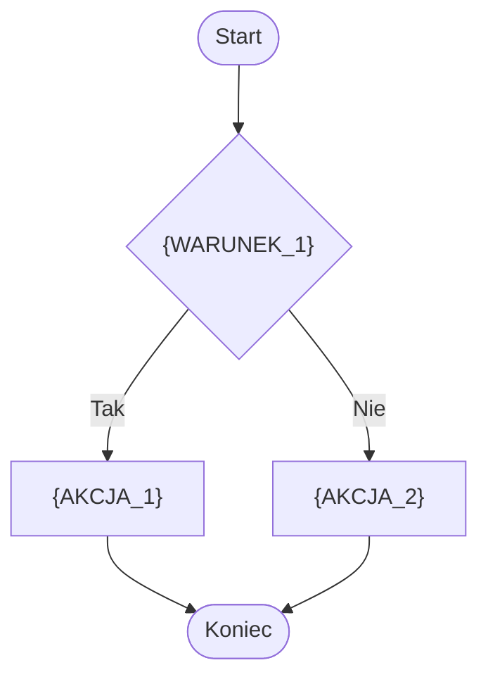

# {TYTUL_ALGORYTMU} — algorytm

| Pole | Wartość |
|---|---|
| ID dokumentu | {ALG-KATEGORIA-NAZWA_ALGORYTMU} |
| Typ dokumentu | algorytm |
| Wersja | 0.1 |
| Status | szkic |
| Autor (ostatnia modyfikacja) | Agent Claudiusz Sonte 4.6 max |
| Data ostatniej modyfikacji | 2026-05-31 |

## Streszczenie

{/* Instrukcja: 2–4 zdania. Czym jest ten algorytm z perspektywy biznesowej. Jaki problem rozwiązuje, w jakim kontekście jest stosowany. */}
{OPIS_BIZNESOWY_ALGORYTMU}

## Cel algorytmu

{/* Instrukcja: 1–3 zdania skupione wyłącznie na celu — co oblicza lub co waliduje ten algorytm. */}
{CEL_ALGORYTMU}

## Charakterystyka

| Atrybut | Wartość |
|---|---|
| ID algorytmu | {ALG-KATEGORIA-NAZWA_ALGORYTMU} |
| Kategoria | {walidacji / wyliczeniowe / autoryzacyjne / konwersji / sortowania / ...} |
| Wejście | {LISTA_PARAMETROW_WEJSCIOWYCH_Z_TYPAMI} |
| Wyjście | {TYP_I_OPIS_WYNIKU} |
| Złożoność (orientacyjna) | {O(1) / O(n) / O(n²) / Do ustalenia} |
| Gdzie wywoływany | {UCZESNIK: Serwis / Kontroler / Frontend} |
| Powiązana metoda w kodzie | {LINK_DO_METODY_W_REPO} |

## Opis krok po kroku

{/* Instrukcja: Lista numerowana kroków algorytmu. Każdy krok to jedno działanie. Dla rozgałęzień warunkowych używaj podpunktów lub opisu "Jeśli ... → ...". */}

1. {OPIS_KROKU_1}
2. {OPIS_KROKU_2}
3. {OPIS_KROKU_3}

## Diagram przepływu

{/* Instrukcja: Diagram Mermaid flowchart ilustrujący logikę algorytmu. Opcjonalny — usuń jeśli algorytm jest trivialny. */}

## Przypadki brzegowe

{/* Instrukcja: Opisz sytuacje graniczne, w których algorytm zachowuje się inaczej lub może dawać nieoczekiwane wyniki. */}

| Przypadek | Dane wejściowe | Oczekiwane zachowanie |
|---|---|---|
| {NAZWA_PRZYPADKU} | {OPIS_DANYCH_WEJSCIOWYCH} | {OCZEKIWANY_WYNIK_LUB_ZACHOWANIE} |

## Powiązania

- Wywoływany z procesu: {LINKI_DO_PROCESOW}
- Wywoływany z endpointu: {LINKI_DO_ENDPOINTOW}
- Powiązane reguły walidacji: {LINKI_LUB_OPIS}

## Powiązania z kodem

- Klasa implementująca: {LINK_DO_PLIKU_CS}
- Metoda: `{NazwaKlasy}.{NazwaMetody}({PARAMETRY})`

## Wątpliwości i braki

{/* Instrukcja: Lista rzeczy nieustalonych z kodu lub wymagających decyzji właściciela projektu. Jeśli brak — wpisz: "Brak". */}
Brak.

## Rejestr zmian

| Wersja | Data | Autor | Opis zmiany |
|---|---|---|---|
| 0.1 | 2026-05-31 | Agent Claudiusz Sonte 4.6 max | Pierwsza wersja. |
