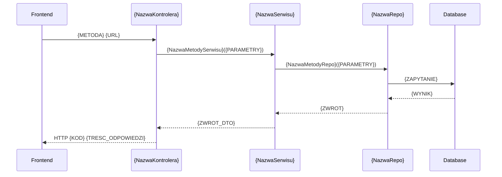

# {TYTUL_ENDPOINTU} — endpoint API

| Pole | Wartość |
|---|---|
| ID dokumentu | {API-NAZWA_ENDPOINTU} |
| Typ dokumentu | API |
| Wersja | 0.1 |
| Status | szkic |
| Autor (ostatnia modyfikacja) | Agent Claudiusz Sonte 4.6 max |
| Data ostatniej modyfikacji | 2026-05-31 |

## Streszczenie

{/* Instrukcja: 2–4 zdania. Czym jest ten endpoint z perspektywy biznesowej. Do czego służy, kto go wywołuje i jaki efekt osiąga. */}
{OPIS_BIZNESOWY_ENDPOINTU}

## Charakterystyka endpointu

| Atrybut | Wartość |
|---|---|
| ID endpointu | {API-NAZWA_ENDPOINTU} |
| Metoda HTTP | {GET / POST / PUT / DELETE / PATCH} |
| URL | {WZORZEC_URL_NP_/api/v1/resource/{id}} |
| Wymagana autoryzacja | {tak — Bearer JWT / nie} |
| Wymagana rola | {User / Admin / brak} |
| Kontroler | `{NazwaKontrolera}` |
| Akcja kontrolera | `{NazwaMetody}` |

## Żądanie

{/* Instrukcja: Jeśli GET lub DELETE bez ciała — wpisz "Nie dotyczy" w podsekcji "Ciało". Parametry route/query opisz mimo to. */}

### Parametry route

| Parametr | Typ | Wymagany | Opis |
|---|---|---|---|
| `{nazwaParametru}` | {string / int / guid} | {tak / nie} | {OPIS} |

### Parametry query

| Parametr | Typ | Wymagany | Domyślna | Opis |
|---|---|---|---|---|
| `{nazwaParametru}` | {string / int / bool} | {tak / nie} | {WARTOSC_LUB_Brak} | {OPIS} |

### Ciało żądania (DTO)

- DTO: {LINK_DO_DOKUMENTU_DTO} — `{NazwaDto}`

### Przykład żądania

```json
{
  "{nazwaPolaDto}": "{PRZYKLADOWA_WARTOSC}",
  "{nazwaPolaDto2}": "{PRZYKLADOWA_WARTOSC_2}"
}
```

## Odpowiedzi

| Kod HTTP | Znaczenie | DTO odpowiedzi | Opis błędu |
|---|---|---|---|
| 200 | Sukces | {LINK_DO_DTO} — `{NazwaDto}` | Nie dotyczy |
| 201 | Zasób utworzony | {LINK_DO_DTO_LUB_Brak} | Nie dotyczy |
| 400 | Błąd walidacji | `ValidationProblemDetails` | {OPIS_MOZLIWYCH_BLEDOW_WALIDACJI} |
| 401 | Brak autoryzacji | Brak | Token nieobecny lub nieważny |
| 403 | Brak uprawnień | Brak | Rola niewystarczająca |
| 404 | Zasób nie istnieje | Brak | {OPIS_WARUNKU_404} |
| 500 | Błąd serwera | Brak | Nieoczekiwany wyjątek |

### Przykład odpowiedzi (200)

```json
{
  "{nazwaPolaDto}": "{PRZYKLADOWA_WARTOSC}"
}
```

## Diagram sekwencji

{/* Instrukcja: Diagram Mermaid sequenceDiagram pokazujący pełny przepływ żądania przez warstwy aplikacji. */}



## Powiązania

- Wywoływany z ekranu: {LINKI_DO_EKRANOW}
- Wywołany przez operację: {LINKI_DO_OPERACJI}
- Powiązany proces: {LINKI_DO_PROCESOW}

## Powiązania z kodem

- Kontroler: {LINK_DO_PLIKU_CS_KONTROLERA}
- Serwis: {LINK_DO_PLIKU_CS_SERWISU}
- Repozytorium: {LINK_DO_PLIKU_CS_REPO}

## Wątpliwości i braki

{/* Instrukcja: Lista rzeczy nieustalonych z kodu lub wymagających decyzji właściciela projektu. Jeśli brak — wpisz: "Brak". */}
Brak.

## Rejestr zmian

| Wersja | Data | Autor | Opis zmiany |
|---|---|---|---|
| 0.1 | 2026-05-31 | Agent Claudiusz Sonte 4.6 max | Pierwsza wersja. |
