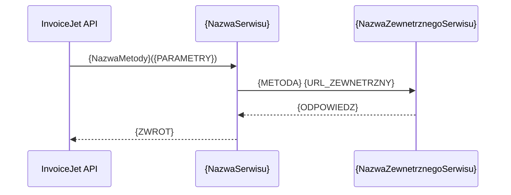

# {TYTUL_INTEGRACJI} — integracja zewnętrzna

| Pole | Wartość |
|---|---|
| ID dokumentu | {INT-NAZWA_INTEGRACJI} |
| Typ dokumentu | integracja |
| Wersja | 0.1 |
| Status | szkic |
| Autor (ostatnia modyfikacja) | Agent Claudiusz Sonte 4.6 max |
| Data ostatniej modyfikacji | 2026-05-31 |

## Streszczenie

{/* Instrukcja: 2–4 zdania. Z jakim zewnętrznym systemem lub serwisem integruje się InvoiceJet. Jaki cel biznesowy realizuje ta integracja. */}
{OPIS_BIZNESOWY_INTEGRACJI}

## Charakterystyka integracji

| Atrybut | Wartość |
|---|---|
| ID integracji | {INT-NAZWA_INTEGRACJI} |
| Zewnętrzny system / serwis | {NAZWA_SERWISU_ZEWNETRZNEGO} |
| Typ integracji | {REST API / SOAP / biblioteka .NET / webhook / plik} |
| Kierunek | {wychodzący / przychodzący / dwukierunkowy} |
| Protokół | {HTTPS / HTTP / FTP / ...} |
| Środowisko produkcyjne (URL bazowy) | {URL_PRODUKCYJNY_LUB_Do ustalenia} |
| Środowisko testowe (URL bazowy) | {URL_TESTOWY_LUB_Do ustalenia} |
| Autoryzacja | {API Key / OAuth 2.0 / Basic / Nie dotyczy} |
| Lokalizacja klucza/tokenu | {appsettings / sekret / zmienna środowiskowa} |

## Wywoływane operacje / endpointy zewnętrzne

{/* Instrukcja: Wymień operacje po stronie zewnętrznego serwisu, z których korzysta InvoiceJet. */}

| Operacja zewnętrzna | Metoda HTTP | URL zewnętrzny | Cel biznesowy |
|---|---|---|---|
| {NAZWA_OPERACJI} | {GET / POST / ...} | {WZORZEC_URL} | {CEL} |

## Mapowanie danych

{/* Instrukcja: Opisz, jak dane InvoiceJet mapują się na dane zewnętrznego serwisu (i odwrotnie). */}

| Pole InvoiceJet (DTO / encja) | Pole zewnętrzne | Transformacja |
|---|---|---|
| `{NazwaPola}` | `{external_field}` | {bezpośrednie / konwersja / Nie dotyczy} |

## Diagram sekwencji

{/* Instrukcja: Diagram Mermaid sequenceDiagram pokazujący przepływ wywołania integracji. */}

## Obsługa błędów i timeoutów

| Scenariusz | Reakcja systemu |
|---|---|
| Timeout połączenia | {OPIS_REAKCJI} |
| Błąd autoryzacji (401/403) | {OPIS_REAKCJI} |
| Błąd serwisu zewnętrznego (5xx) | {OPIS_REAKCJI} |
| Niepoprawna odpowiedź (format) | {OPIS_REAKCJI} |

## Powiązania

- Wywoływana z procesu: {LINKI_DO_PROCESOW}
- Wywoływana przez endpoint: {LINKI_DO_ENDPOINTOW}
- Powiązane DTO: {LINKI_DO_DTO}

## Powiązania z kodem

- Serwis integracji: {LINK_DO_PLIKU_CS}
- Konfiguracja (appsettings): {LINK_DO_PLIKU_KONFIGURACJI}
- Rejestracja w DI: {LINK_DO_PLIKU_PROGRAM_CS_LUB_STARTUP}

## Wątpliwości i braki

{/* Instrukcja: Lista rzeczy nieustalonych z kodu lub wymagających decyzji właściciela projektu. Jeśli brak — wpisz: "Brak". */}
Brak.

## Rejestr zmian

| Wersja | Data | Autor | Opis zmiany |
|---|---|---|---|
| 0.1 | 2026-05-31 | Agent Claudiusz Sonte 4.6 max | Pierwsza wersja. |
