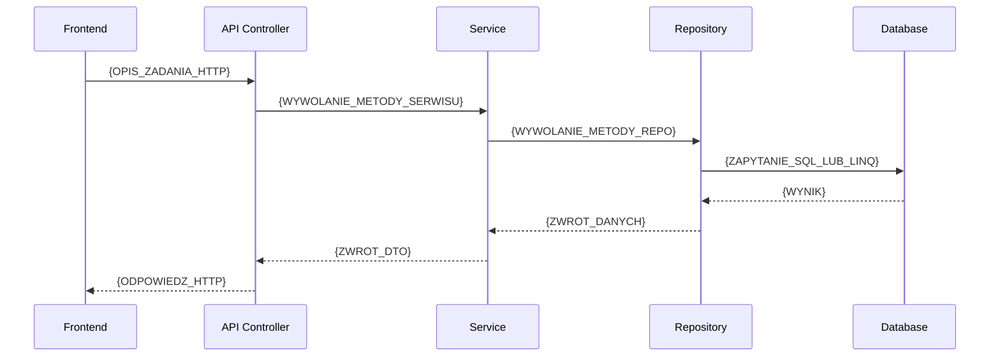

# {TYTUL_PROCESU} — proces techniczny

| Pole | Wartość |
|---|---|
| ID dokumentu | {PROC-NAZWA_PROCESU} |
| Typ dokumentu | proces |
| Wersja | 0.1 |
| Status | szkic |
| Autor (ostatnia modyfikacja) | Agent Claudiusz Sonte 4.6 max |
| Data ostatniej modyfikacji | 2026-05-31 |

## Streszczenie

{/* Instrukcja: 2–4 zdania. Czym jest ten proces z perspektywy biznesowej i technicznej. Jaki cel realizuje. */}
{OPIS_BIZNESOWY_PROCESU}

## Cel procesu

{/* Instrukcja: 1–3 zdania skupione wyłącznie na celu — co osiąga zakończenie tego procesu sukcesem. */}
{CEL_PROCESU}

## Charakterystyka

| Atrybut | Wartość |
|---|---|
| ID procesu | {PROC-NAZWA_PROCESU} |
| Typ | {główny / pomocniczy} |
| Inicjator | {LINK_DO_EKRANU} + {LINK_DO_OPERACJI} |
| Warunki startu | {WARUNKI_NIEZBEDNE_DO_URUCHOMIENIA} |
| Warunki zakończenia (sukces) | {WARUNKI_POMYSLNEGO_ZAKONCZENIA} |
| Warunki zakończenia (błąd) | {MOZLIWE_SCENARIUSZE_BLEDU} |
| Uczestnicy | {FRONTEND / BACKEND / BAZA_DANYCH / SERWIS_ZEWNETRZNY} |

## Diagram sekwencji

{/* Instrukcja: Diagram Mermaid sequenceDiagram pokazujący przepływ między uczestnikami. Uczestnicy: Frontend, API, Service, Repository, DB. */}

## Kroki

{/* Instrukcja: Lista numerowana. Każdy krok to jedno działanie jednego uczestnika. Opisz warunki przejścia między krokami. */}

1. {OPIS_KROKU_1}
2. {OPIS_KROKU_2}
3. {OPIS_KROKU_3}

## Obsługa błędów

{/* Instrukcja: Opisz każdy możliwy scenariusz błędu i reakcję systemu. */}

| Błąd | Miejsce wystąpienia | Reakcja |
|---|---|---|
| {NAZWA_BLEDU} | {UCZESNIK_PROCESU} | {OPIS_REAKCJI} |

## Powiązania

- Wywołany z ekranu: {LINK_DO_EKRANU}
- Wywołany przez operację: {LINK_DO_OPERACJI}
- Powiązane API: {LINKI_DO_ENDPOINTOW}
- Powiązany algorytm: {LINKI_DO_ALGORYTMOW_LUB_Nie dotyczy}

## Powiązania z kodem

- Kontroler: {LINK_DO_PLIKU_CS_KONTROLERA}
- Serwis: {LINK_DO_PLIKU_CS_SERWISU}
- Repozytorium: {LINK_DO_PLIKU_CS_REPO}

## Wątpliwości i braki

{/* Instrukcja: Lista rzeczy nieustalonych z kodu lub wymagających decyzji właściciela projektu. Jeśli brak — wpisz: "Brak". */}
Brak.

## Rejestr zmian

| Wersja | Data | Autor | Opis zmiany |
|---|---|---|---|
| 0.1 | 2026-05-31 | Agent Claudiusz Sonte 4.6 max | Pierwsza wersja. |
