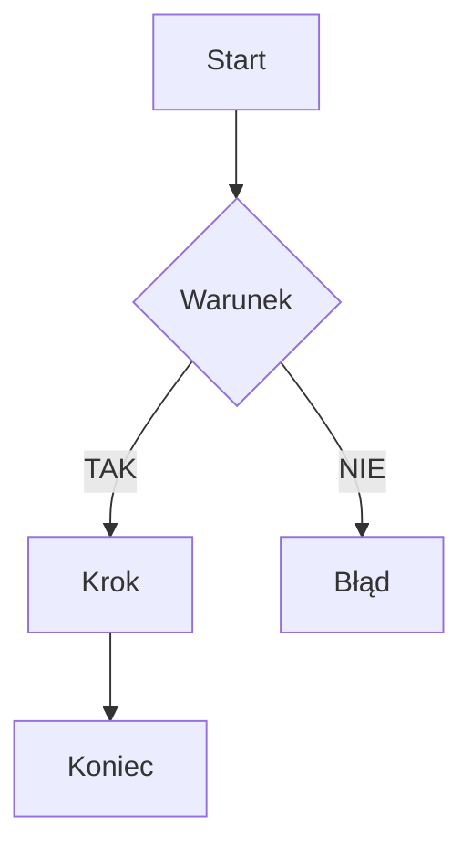

# Proces: [Nazwa procesu]

| Atrybut | Wartość |
|---|---|
| ID | P-XX |
| Nazwa | NazwaProcesu |
| Kontroler | `NazwaController` |
| Serwis | `NazwaService` |
| Endpointy | `METHOD /api/Endpoint` |
| AuthGuard | TAK / NIE |
| Ostatnia walidacja | YYYY-MM-DD |
| Autor | Agent Claudiusz Sonte 4.6 max |

## Cel biznesowy

[Opis celu biznesowego procesu]

## Diagram przepływu



## Walidacje

| ID | Warunek | Wyjątek | HTTP |
|---|---|---|---|
| WAL-01 | [opis warunku] | `NazwaException` | 400/404/409 |

## Kroki algorytmu

1. Krok 1
2. Krok 2
3. Krok 3

## Komponenty

| Warstwa | Komponent |
|---|---|
| Presentation | `NazwaController.Metoda()` |
| Application | `NazwaService.Metoda()` |
| Domain | Encja, Wyjątek |
| Infrastructure | Repozytorium, UoW |

## Dane wejściowe

```json
{}
```

## Dane wyjściowe

```json
{}
```

## Anomalie

| # | Anomalia |
|---|---|
| XX-01 | ... |

## Rejestr zmian

| Wersja | Data | Autor | Opis |
|---|---|---|---|
| 1.0 | YYYY-MM-DD | Agent Claudiusz Sonte 4.6 max | Dokument wstępny. |
