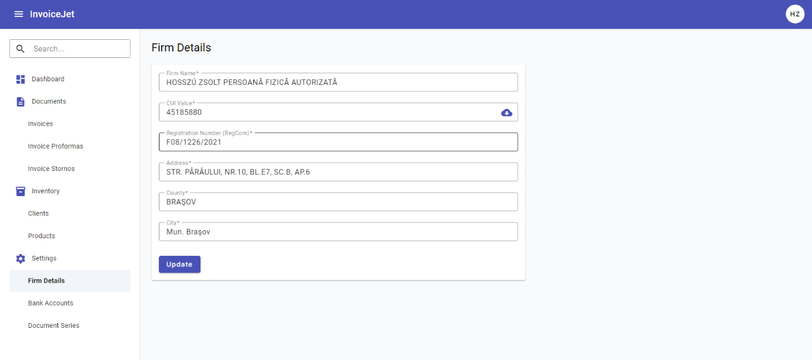

# Dane firmy (Firm Details)

## Co to jest?
Ekran, na którym wprowadzasz i aktualizujesz dane swojej firmy jako wystawcy faktur. Dane te są automatycznie drukowane na każdym dokumencie.

> ⚠️ **Wymagane przed pierwszą fakturą.** Bez uzupełnienia tych danych nie możesz wystawiać dokumentów.

---

## Pola formularza

| Pole | Opis |
|---|---|
| **Firm Name** | Pełna nazwa firmy |
| **CUI** | Numer identyfikacji podatkowej + przycisk ☁ (autouzupełnianie) |
| **Reg. Com.** | Numer rejestracji handlowej |
| **Address** | Adres siedziby |
| **County** | Okręg / województwo |
| **City** | Miasto |

---

## Co możesz zrobić?

### Uzupełnienie / edycja danych
Wpisz lub zmień wartości i kliknij **Save**.

### Autouzupełnianie z rejestru publicznego ☁
Obok pola **CUI** znajduje się ikona chmury. Po wpisaniu numeru CUI kliknij ją — aplikacja automatycznie pobierze dane firmy z publicznego rejestru i wypełni pozostałe pola.

---

## Ważne informacje
- Pierwsze wejście = formularz dodawania; kolejne = formularz edycji
- Przycisk **Save** jest aktywny po wprowadzeniu zmian

---

📖 Instrukcja krok po kroku: [P-03 Konfiguracja danych firmy](../02_procesy/P-03_konfiguracja_firmy.md)

🔗 Po uzupełnieniu danych przejdź do: [Konta bankowe](07_konta_bankowe.md) · [Serie dokumentów](09_serie_dokumentow.md)
