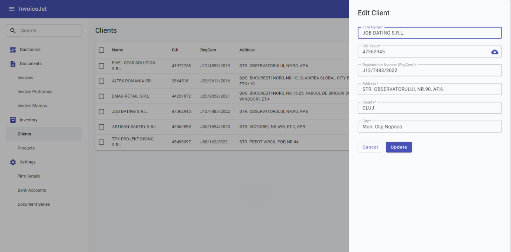

# Klienci (Clients)

## Co to jest?
Lista Twoich kontrahentów — firm, którym wystawiasz faktury. Stąd zarządzasz całą bazą klientów.

---

## Kolumny tabeli

| Kolumna | Co pokazuje |
|---|---|
| ☐ | Zaznaczanie do operacji masowych |
| **Name** | Nazwa firmy klienta |
| **CUI** | Numer identyfikacji podatkowej klienta |
| **Reg. Com.** | Numer rejestracji handlowej |
| **Address** | Adres |
| **County** | Okręg |
| **City** | Miasto |

---

## Co możesz zrobić?

### Dodanie nowego klienta
Kliknij **Add Client** — otworzy się okno dialogowe z formularzem. Wypełnij dane i zapisz.

**Pola formularza klienta:**

| Pole | Opis |
|---|---|
| **Name** | Pełna nazwa firmy klienta |
| **CUI** | Numer identyfikacji podatkowej |
| **Reg. Com.** | Numer rejestracji handlowej |
| **Address** | Adres siedziby |
| **County** | Okręg |
| **City** | Miasto |

### Edycja klienta
Kliknij na wiersz klienta w tabeli — otworzy się ten sam formularz z wypełnionymi danymi.

### Usunięcie klienta
1. Zaznacz klientów (☐ po lewej stronie wiersza)
2. Kliknij **Delete**

### Sortowanie i filtrowanie
Kliknij nagłówek kolumny, aby posortować listę.

---

## Ważne informacje
- Klienci z tej listy są dostępni jako podpowiedzi przy [wystawianiu faktury](10b_formularz_faktury.md)
- Usunięcie klienta nie usuwa wystawionych dla niego faktur

---

📖 Instrukcja krok po kroku: [P-08 Dodanie kontrahenta](../02_procesy/P-08_dodawanie_kontrahenta.md)
