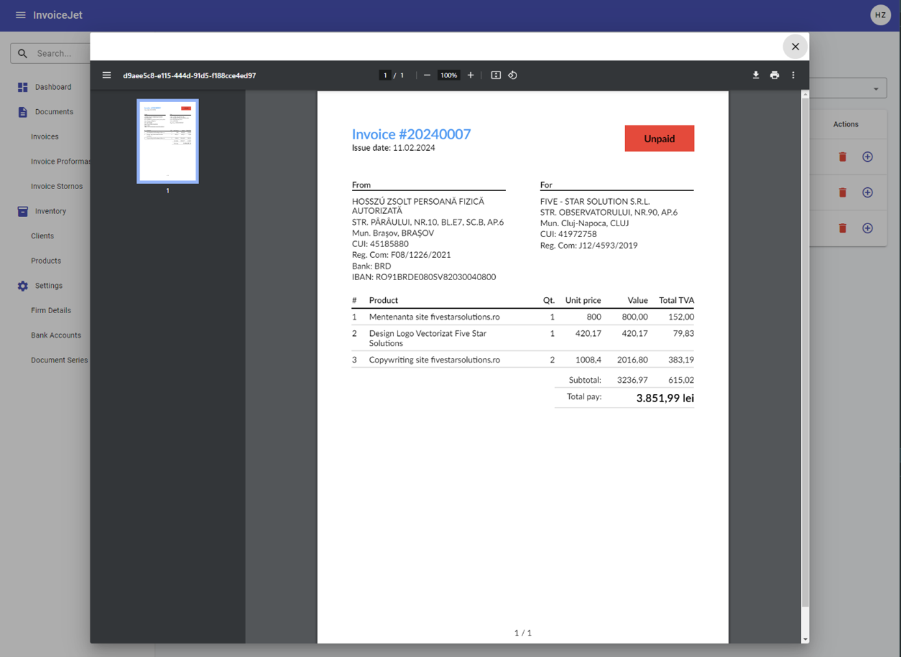

# Formularz faktury — dodawanie i edycja

## Co to jest?
Formularz do wystawienia nowej faktury lub edycji istniejącej. Ten sam formularz obsługuje [faktury zwykłe](10_faktury.md), [proformy](11_proformy.md) i [storna](12_storna.md) — różni je tylko typ dokumentu.

---

## Sekcja: dane dokumentu

| Pole | Opis |
|---|---|
| **Client** | Kontrahent — wpisz fragment nazwy, wybierz z podpowiedzi → [Klienci](06_klienci.md) |
| **Document Series** | Seria numeracyjna — wybierz z listy → [Serie dokumentów](09_serie_dokumentow.md) |
| **Issue Date** | Data wystawienia — wybierz z kalendarza |
| **Due Date** | Termin płatności — wybierz z kalendarza |
| **Status** | **Unpaid** (nieopłacona) lub **Paid** (opłacona) |

---

## Sekcja: pozycje faktury

Tutaj dodajesz co sprzedajesz. Każda pozycja to jeden wiersz.

| Kolumna | Opis |
|---|---|
| **Name** | Nazwa — wpisz ręcznie lub wybierz z katalogu → [Produkty](08_produkty.md) |
| **Unit Price** | Cena za jednostkę |
| **Quantity** | Ilość |
| **Unit of Measurement** | Jednostka miary (szt., godz., kg…) |
| **TVA Value** | Stawka VAT (%) |
| **Contains TVA** | Zaznacz jeśli podana cena jest brutto (z VAT) |
| **Total Price** | Wyliczane automatycznie |
| **Actions** | 🗑 Usuń tę pozycję |

Kliknij **Add Product** (lub „+"), żeby dodać kolejny wiersz.

---

## Przyciski akcji

| Przycisk | Co robi |
|---|---|
| **Save** | Zapisuje fakturę |
| **Preview PDF** | Otwiera podgląd dokumentu PDF w oknie (bez zapisywania pliku) |
| **Generate PDF** | Generuje i zapisuje plik PDF |

---

## Podgląd PDF

Po kliknięciu **Preview PDF** otwiera się okno z gotowym dokumentem. Możesz go obejrzeć, a następnie zamknąć i wrócić do edycji.
Szczegóły: [P-10 Generowanie PDF](../02_procesy/P-10_generowanie_pdf.md).

---

## Ważne informacje
- Przed wystawieniem faktury musisz mieć uzupełnione: [Dane firmy](05_dane_firmy.md) i przynajmniej jedną [Serię dokumentów](09_serie_dokumentow.md)
- Jeśli klient nie ma go na liście podpowiedzi → wejdź do [Klientów](06_klienci.md) i dodaj go najpierw
- Wartości pozycji i suma końcowa wyliczane są automatycznie

---

📖 Instrukcja krok po kroku: [P-06 Wystawianie faktury](../02_procesy/P-06_wystawianie_faktury.md)

🔗 Wróć do listy: [Faktury](10_faktury.md) · [Proformy](11_proformy.md) · [Storna](12_storna.md)
