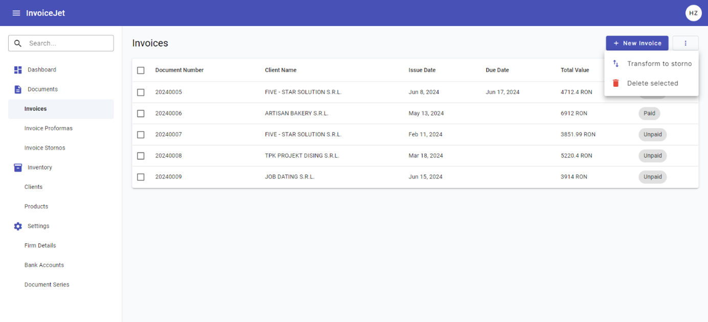

# Faktury proforma (Invoice Proformas)

> Ekran proform wygląda identycznie jak [lista faktur](10_faktury.md) — te same kolumny i układ.

## Co to jest?
Lista faktur proforma. Proforma to dokument wstępny informujący klienta o warunkach planowanej transakcji. **Nie jest dokumentem księgowym** — nie podlega ewidencji VAT i nie zastępuje faktury właściwej.

Używasz proformy np. gdy klient musi zatwierdzić zamówienie lub wpłacić zaliczkę przed realizacją.

---

## Kolumny tabeli

Identyczne jak w [Fakturach](10_faktury.md):

| Kolumna | Co pokazuje |
|---|---|
| ☐ | Zaznaczanie |
| **Document Number** | Numer proformy |
| **Client Name** | Kontrahent → [Klienci](06_klienci.md) |
| **Issue Date** | Data wystawienia |
| **Due Date** | Termin |
| **Total Value** | Wartość brutto |
| **Status** | **Unpaid** / **Paid** |

---

## Co możesz zrobić?

| Akcja | Jak |
|---|---|
| **Nowa proforma** | Kliknij **Add Invoice Proforma** → [Formularz](10b_formularz_faktury.md) |
| **Edycja** | Kliknij na wiersz → [Formularz](10b_formularz_faktury.md) |
| **Usunięcie** | Zaznacz (☐) → **Delete** |
| **PDF** | Z [formularza](10b_formularz_faktury.md) → Preview PDF / Generate PDF |

---

## Różnice względem faktur zwykłych

| Cecha | [Faktury](10_faktury.md) | Proformy |
|---|---|---|
| Dokument księgowy | ✅ Tak | ❌ Nie |
| Transform to Storno | ✅ Tak | ❌ Nie |
| Własna seria numeracji | ✅ Tak | ✅ Tak (osobna) |

---

## Ważne informacje
- Proformy mają **własną serię numeracji** — skonfiguruj ją osobno w [Seriach dokumentów](09_serie_dokumentow.md)
- Jeśli po wystawieniu proformy chcesz wystawić fakturę właściwą, musisz ją wystawić osobno w zakładce [Faktury](10_faktury.md)

---

📖 Instrukcja krok po kroku: [P-09 Wystawianie proformy](../02_procesy/P-09_wystawianie_proformy.md)
