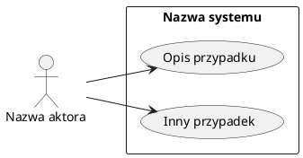
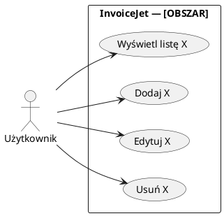
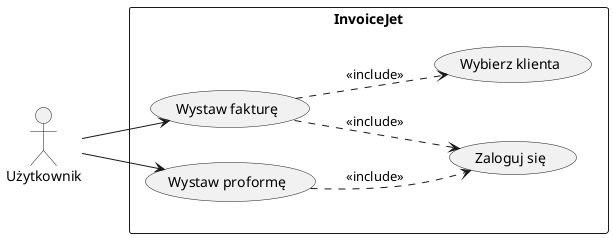
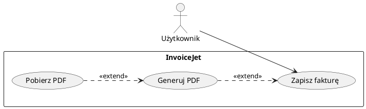
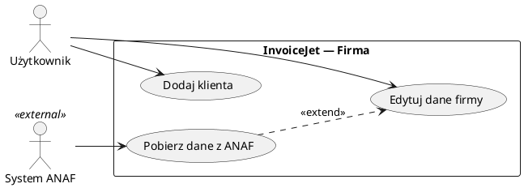
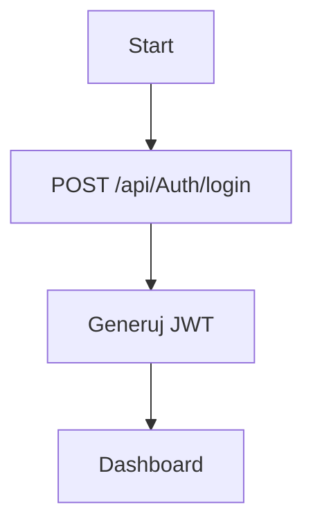
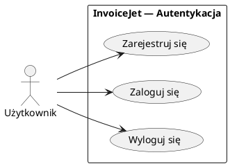
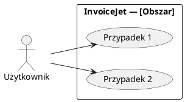

# Skill: plantuml-usecase

Profesjonalne diagramy PlantUML UseCase dla dokumentacji InvoiceJet.

---

## 1. Kluczowa różnica: UseCase vs Flowchart

| | PlantUML UseCase | Mermaid Flowchart |
|---|---|---|
| **Pokazuje** | KTO może CO zrobić (aktorzy + przypadki użycia) | JAK działa (kroki, decyzje, przepływ) |
| **Jednostka** | Przypadek użycia (owal) — cel aktora | Krok procesu (prostokąt/romb) |
| **Relacje** | association, include, extend, generalization | strzałki warunkowe, pętle |
| **Zastosowanie** | requirements, scope systemu | opis procesu technicznego |

> **Zasada:** UseCase diagram odpowiada na pytanie „Co system umożliwia aktorowi?", nie „Jak to technicznie działa?".

---

## 2. Składnia PlantUML UseCase

### Minimalna struktura



### Elementy składni

| Element | Składnia | Opis |
|---|---|---|
| Aktor | `actor "Nazwa" as A` | Ludzik lub `actor "Nazwa" as A <<system>>` dla zewnętrznego |
| Przypadek użycia | `usecase "Opis" as UCn` | Owal; opis = cel użytkownika |
| Granica systemu | `rectangle "System" { ... }` | Prostokąt otaczający use case'y |
| Asocjacja | `A --> UC1` | Aktor inicjuje UC |
| Include | `UC1 ..> UC2 : <<include>>` | UC2 ZAWSZE wykonywany w ramach UC1 |
| Extend | `UC2 ..> UC1 : <<extend>>` | UC2 opcjonalnie rozszerza UC1 |
| Generalizacja aktora | `Admin --|> User` | Admin dziedziczy po User |
| Generalizacja UC | `UC2 --|> UC1` | UC2 specjalizuje UC1 |
| Nota | `note right of UC1 : tekst` | Komentarz |

### Kierunek

```plantuml
left to right direction   " poziomy układ (zalecany dla małych diagramów)
top to bottom direction   " pionowy układ (domyślny, dobry dla dużych)
```

### Skinparam (opcjonalnie)

```plantuml
skinparam usecase {
  BackgroundColor LightBlue
  BorderColor DarkBlue
  ArrowColor DarkBlue
}
skinparam actor {
  BackgroundColor LightYellow
}
```

---

## 3. Wzorce dla InvoiceJet

### Jeden aktor, wiele UC



### Z relacją include (wspólne prereq)



### Z relacją extend (opcjonalne kroki)



### Wielu aktorów



---

## 4. Konwersja z Mermaid flowchart → PlantUML UseCase

Gdy zamieniasz Mermaid flowchart na PlantUML UseCase:

1. **Zidentyfikuj aktorów** — kto inicjuje akcje (człowiek, system zewnętrzny)
2. **Zidentyfikuj use case'y** — CELE aktora (czasownik + rzeczownik), nie kroki techniczne
3. **Wyrzuć techniczne szczegóły** — API calls, błędy 400/500, console.log → to do scenariuszy, nie diagramu
4. **Zidentyfikuj relacje:**
   - Krok ZAWSZE poprzedza inny → `<<include>>`
   - Krok jest OPCJONALNY → `<<extend>>`
   - Ten sam aktor robi podobne rzeczy → generalizacja
5. **Granica systemu** = jeden prostokąt `rectangle "InvoiceJet — [Obszar]"`

### Przykład konwersji

**Mermaid (ZŁY format dla UC):**


**PlantUML UseCase (DOBRY):**


---

## 5. Checklist walidacji — PRZED wstawieniem

- [ ] `@startuml` na początku, `@enduml` na końcu
- [ ] Każdy `usecase` ma alias (`as UCn`)
- [ ] Każdy `actor` ma alias (`as A`)
- [ ] Brak `;` w labelach
- [ ] Brak polskich znaków w aliasach (A, UC1 — nie „Użytkownik")
- [ ] Polskie znaki OK w labelach w `" "` (np. `actor "Użytkownik" as U`)
- [ ] Każdy `rectangle { }` jest zamknięty
- [ ] Relacje `..>` ze stereotypem (`<<include>>` / `<<extend>>`) są w `" "` (np. `: <<include>>`)
- [ ] Brak kroków technicznych (API calls, błędy HTTP) w diagramie — te idą do scenariuszy
- [ ] Maksymalnie 10–12 use case'ów na diagramie (czytelność)

---

## 6. Wzorzec dokumentu UseCase (sekcja Diagram)

W każdym pliku `.md` z UC zastąp sekcję `## Diagram` tym wzorcem:

```markdown
## Diagram (PlantUML UseCase)


```

---

## 7. Powiązane

- Wytyczne diagramów: [`wytyczne/01_zasady_zlote_i_ogolne.md`](../../../InvoiceJet/wytyczne/01_zasady_zlote_i_ogolne.md) §RO-01
- Skill `mermaid-diagrams`: dla diagramów sekwencji, flowchart, klas
- Wzorzec istniejący: [`doc_AI/07_use_case/UC-01_ZarzadzanieKontem.md`](../../../InvoiceJet/doc_AI/07_use_case/UC-01_ZarzadzanieKontem.md)
