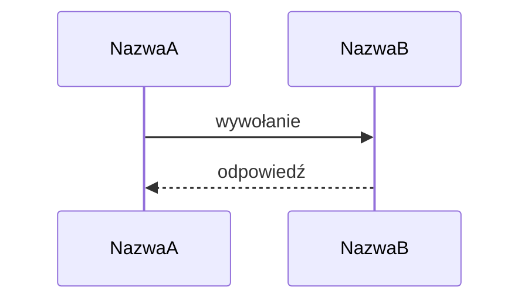
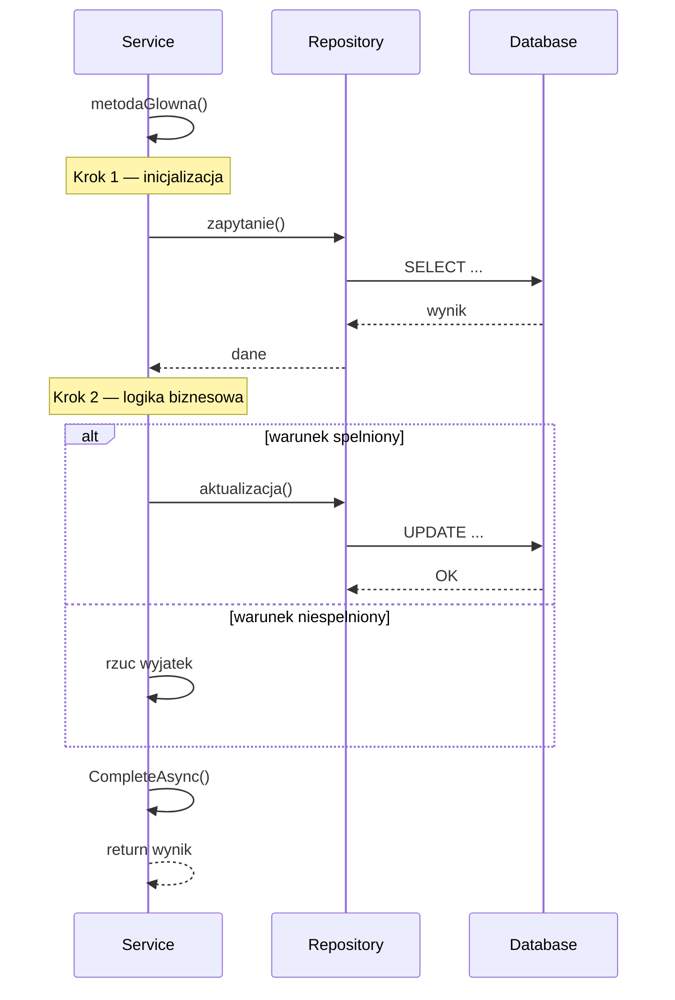
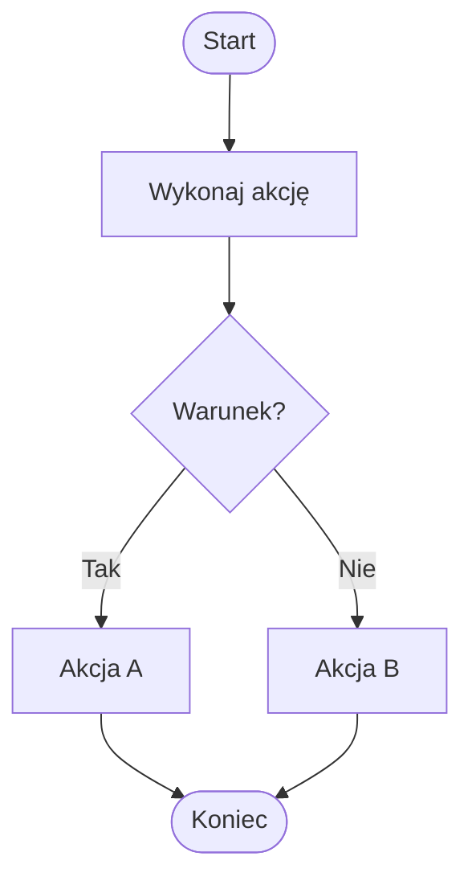
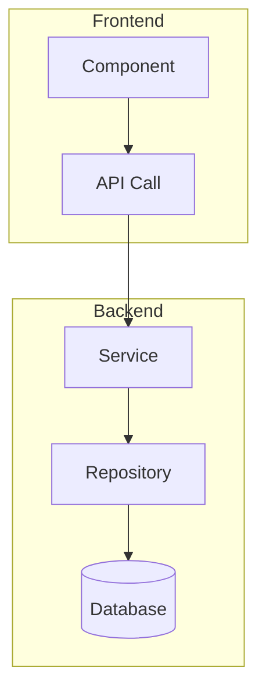
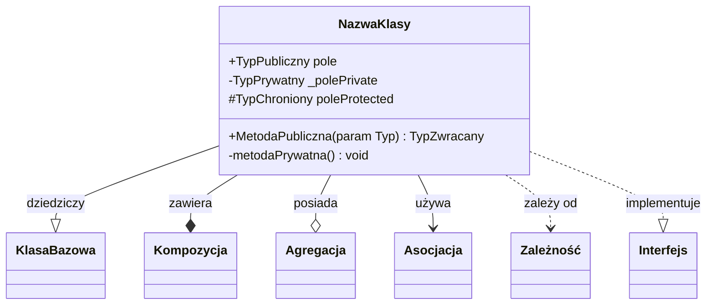
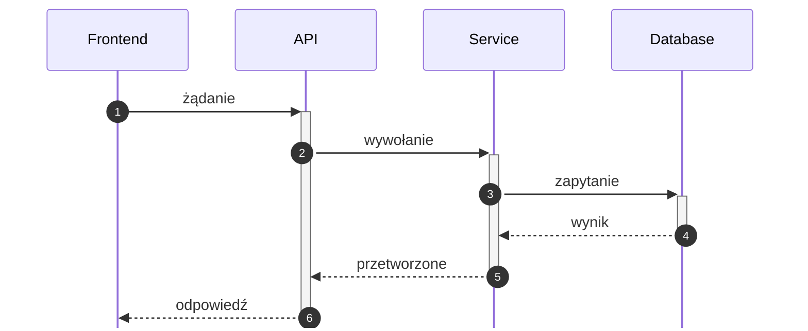
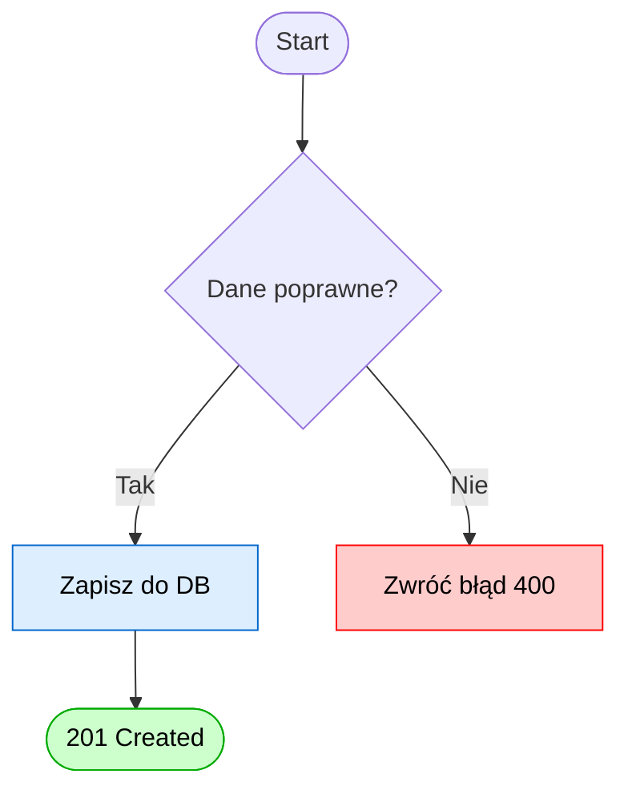

# Skill: mermaid-diagrams

Profesjonalne diagramy Mermaid z wbudowaną walidacją składni.
Obsługiwane typy: **sequence** · **flowchart (aktywności)** · **class**

---

## REGUŁA #1 — ZAWSZE waliduj przed wstawieniem

Każdy diagram przechodzi przez checklist z §6 **zanim** trafi do pliku.
Jeden błąd składni = cały diagram nie renderuje się. Zero wyjątków.

---

## 1. Znaki zabronione w labelach (we wszystkich typach)

Mermaid parsuje etykiety jako tekst — poniższe znaki **łamią parser** gdy stoją raw:

| Znak | Problem | Zamiennik |
|---|---|---|
| `;` | kończy statement | usuń lub zastąp `,` / opisem słownym |
| `←` `→` `↑` `↓` | Unicode arrows nieobsługiwane | użyj `Note over` lub `->>` |
| `(` `)` wewnątrz labelu | niejednoznaczne dla parsera | ` ` spacja lub `[` `]` |
| `{` `}` | składnia specjalna | usuń lub zastąp opisem |
| `"` wewnątrz cudzysłowu | przerywa string | ucieknij jako `&quot;` lub zmień cudzysłów |
| `/` w `participant ... as` | dzieli alias | zmień na dwa uczestnicy lub `+` |
| `#` w labelach | komentarz Mermaid | usuń lub zastąp słownie |
| `%` w liczbach | problematyczny | pisz `pct` lub `procent` |

---

## 2. Diagram sekwencji (`sequenceDiagram`)

### Szkielet



### Typy strzałek

| Strzałka | Znaczenie | Użycie |
|---|---|---|
| `->>` | wywołanie synchroniczne | żądanie, wywołanie metody |
| `-->>` | odpowiedź / zwrot | return, response |
| `-)` | wywołanie asynchroniczne | event, fire-and-forget |
| `-x` | wywołanie z błędem / X | odrzucenie |
| `->` | bez grotu (linia ciągła) | unikaj — mało czytelne |

### Bloki strukturalne

```
loop Opis pętli
    ...
end

alt Warunek A
    ...
else Warunek B
    ...
end

opt Opcjonalne
    ...
end

par Równolegle A
    ...
and Równolegle B
    ...
end

critical Sekcja krytyczna
    ...
option Obsługa błędu
    ...
end
```

### Note (zamiast inline komentarzy!)

```
Note over A: tekst notatki
Note over A,B: tekst obejmuje obu uczestników
Note right of A: po prawej stronie
Note left of A: po lewej stronie
```

> **Zasada:** komentarze/ostrzeżenia **zawsze** jako `Note`, nigdy w labelu strzałki (`←` łamie parser).

### Reguły składni — sekwencja

1. `participant X as Alias` — alias NIE może zawierać `/`, `(`, `)`, `{`, `}`
2. `alt`/`loop`/`opt` — każdy blok musi mieć `end`
3. Każdy blok może być zagnieżdżony, ale max 3 poziomy (czytelność)
4. Label strzałki: tekst po `:` do końca linii — unikaj `;`, `←`, `(text)`
5. `S->>S: ...` — self-message — dozwolone, renderuje pętlę
6. `activate A` / `deactivate A` — opcjonalne podświetlenie paska aktywności

### Wzorzec dla metody pomocniczej



---

## 3. Diagram aktywności / flowchart (`flowchart`)

### Szkielet



Kierunki: `TD` (top-down) · `LR` (left-right) · `BT` (bottom-top) · `RL` (right-left)

### Typy węzłów

| Składnia | Kształt | Użycie |
|---|---|---|
| `A[tekst]` | prostokąt | akcja, krok |
| `A(tekst)` | zaokrąglony | podproces |
| `A([tekst])` | stadium (owal) | start / koniec |
| `A{tekst}` | romb | decyzja (tak/nie) |
| `A{{tekst}}` | sześciokąt | warunek cyklu |
| `A[(tekst)]` | baza danych | zapis do DB |
| `A>tekst]` | asymetryczny | zdarzenie |
| `A((tekst))` | koło | punkt złączenia |

### Strzałki i etykiety

```
A --> B           % zwykła strzałka
A -->|etykieta| B  % etykieta na strzałce — TAK!
A --- B           % linia bez grotu
A -.-> B          % przerywana
A ==> B           % gruba
A -- etykieta --> B  % alternatywna składnia etykiety
```

> **Uwaga:** etykieta na strzałce = `-->|tekst|` — pionowe kreski wokół tekstu. Nie pisz `:tekst`.

### Subgrafy (grupowanie)



### Reguły składni — flowchart

1. ID węzła: tylko `[A-Za-z0-9_]` — bez spacji, polskich znaków, myślników jako ID
2. Tekst wewnątrz `[ ]` — może mieć spacje i polskie znaki
3. Romb decyzji `{tekst}` — tekst NIE powinien kończyć się `?` (niektóre parsery) — pisz jako zdanie
4. Subgraf: `subgraph NazwaId[Etykieta widoczna]` lub `subgraph NazwaId` bez nawiasów
5. Unikaj identycznych ID węzłów w całym diagramie
6. Długi tekst: `A["Długi\ntekst w dwóch liniach"]`

---

## 4. Diagram klas (`classDiagram`)

### Szkielet



### Modyfikatory widoczności

| Symbol | Znaczenie |
|---|---|
| `+` | public |
| `-` | private |
| `#` | protected |
| `~` | package/internal |

### Typy relacji

| Strzałka | Typ | Opis |
|---|---|---|
| `--|>` | dziedziczenie | klasa rozszerza |
| `..|>` | implementacja | klasa implementuje interfejs |
| `--*` | kompozycja | silna zawartość (lifecycle) |
| `--o` | agregacja | słaba zawartość |
| `-->` | asocjacja | używa |
| `..>` | zależność | zależy (słabo) |
| `--` | asocjacja (bez kierunku) | dwustronna |

### Liczebność (multiplicity)

```
ClassA "1" --> "N" ClassB : relacja
ClassA "0..1" --o "many" ClassB : opcjonalna
```

### Reguły składni — class diagram

1. Nazwa klasy: `PascalCase`, bez spacji
2. Typ pola przed nazwą NIE po: `+string Nazwa` ✅ (nie `+Nazwa string`)
3. Metoda: `+NazwaMetody(param Typ) TypZwracany`
4. Interfejs: `class INazwa { <<interface>> }`
5. Enum: `class StatusEnum { <<enumeration>> Wartosc1\nWartosc2 }`
6. Abstract: `class KlasaAbs { <<abstract>> }`
7. Etykieta relacji: po `:` na końcu linii relacji
8. Unikaj wielolinijkowych metod — jeden wpis = jedna linia

---

## 5. Wzorce profesjonalnego diagramu

### Sekwencja — z konfiguracją



`autonumber` — automatyczna numeracja kroków (bardzo czytelne!)
`+`/`-` przy strzałkach — aktywacja/deaktywacja pasków

### Flowchart — z kolorami



---

## 6. Checklist walidacji — PRZED wstawieniem

Przejdź każdy punkt. Jeśli którykolwiek = ❌, popraw przed wstawieniem.

### Ogólne
- [ ] Typ diagramu zadeklarowany w pierwszej linii (`sequenceDiagram`, `flowchart TD`, `classDiagram`)
- [ ] Brak znaków `;` w labelach
- [ ] Brak znaków `←→↑↓` w labelach
- [ ] Brak `(tekst)` wewnątrz labelów strzałek
- [ ] Brak `{tekst}` wewnątrz labelów strzałek (poza flowchart węzłami)
- [ ] Brak `#` poza komentarzami `%%`

### Sekwencja
- [ ] Żaden `participant ... as` alias nie zawiera `/`, `(`, `)`
- [ ] Każdy `alt`/`loop`/`opt`/`par`/`critical` ma odpowiadające `end`
- [ ] Komentarze/ostrzeżenia = `Note over X: ...`, nie inline w labelu
- [ ] Brak duplikujących się nazw uczestników
- [ ] `activate`/`deactivate` są parowane (opcjonalne ale jeśli użyte — muszą być parowane)

### Flowchart
- [ ] Każdy węzeł ma unikalny ID (bez polskich znaków i spacji w ID)
- [ ] Etykiety na strzałkach: `-->|tekst|` (pionowe kreski), nie `-->:tekst`
- [ ] Każdy `subgraph` ma `end`
- [ ] Brak węzłów bez wejścia lub wyjścia (oprócz Start/End)

### Class diagram
- [ ] Nazwy klas w PascalCase bez spacji
- [ ] Typy pól: format `+Typ nazwaPolanm`
- [ ] Relacje mają prawidłowe strzałki (`--|>`, `..|>`, `--*`, `--o`, `-->`)
- [ ] Interfejsy/enumy mają `<<interface>>` / `<<enumeration>>`

---

## 7. Najczęstsze błędy i naprawa

| Objaw | Przyczyna | Naprawa |
|---|---|---|
| Diagram nie renderuje się w ogóle | błąd składni gdziekolwiek | przejdź checklist §6 od góry |
| Brakuje uczestnika | `participant` po pierwszej strzałce | przenieś wszystkich `participant` na górę |
| `alt` bez gałęzi | brak `else` lub pusta gałąź | dodaj `else` lub zamień na `opt` |
| Węzły flowchart się nie łączą | ID z polską literą lub spacją | zmień ID na ASCII |
| Label "ucięty" | niezamknięty cudzysłów lub `:` w nazwie | otocz tekst `"..."` |
| Klasa bez pól | puste `{}` | dodaj przynajmniej jeden wpis lub usuń `{}` |
| Relacja w złym kierunku | odwrócone `--\|>` | sprawdź tabelę relacji §4 |
