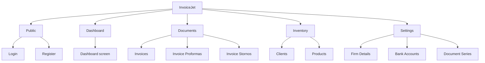

# Mapa Nawigacji i Makiet

**Aplikacja:** InvoiceJet
**Źródło menu:** AOS frontendu `E-00_AppShell`
**Źródło tras:** AOS frontendu i `docs/struktura-katalogow-frontend.md`

## 1. Diagram globalny

## 2. Sekcje i dokumenty

| Sekcja | Route startowy | Dokument mapy |
|---|---|---|
| Global | N/D | [00_GLOBAL](./navigation/00_GLOBAL/01_MAPA_NAWIGACJI_I_MAKIET.md) |
| Dashboard | `/dashboard` | [01_Dashboard](./navigation/01_Dashboard/01_DIAGRAM_SEKCJI.md) |
| Documents | N/D | [02_Documents](./navigation/02_Documents/01_DIAGRAM_SEKCJI.md) |
| Inventory | N/D | [03_Inventory](./navigation/03_Inventory/01_DIAGRAM_SEKCJI.md) |
| Settings | N/D | [04_Settings](./navigation/04_Settings/01_DIAGRAM_SEKCJI.md) |
| Public | `/login`, `/register` | [05_Public](./navigation/05_Public/01_DIAGRAM_SEKCJI.md) |

## 3. Powiązanie z przepływami

| Pozycja menu | Przepływ aplikacyjny | Dokument |
|---|---|---|
| Dashboard | `A-01_Dashboard` | [rejestr](./REJESTR_PRZEPLYWOW_APLIKACJI.md) |
| Invoices | `A-02_Invoices`, `A-05_IssueNewInvoice` | [A-05](./flows/A-05_IssueNewInvoice/00_METADANE.md) |
| Invoice Proformas | `A-03_InvoiceProformas` | [rejestr](./REJESTR_PRZEPLYWOW_APLIKACJI.md) |
| Invoice Stornos | `A-04_InvoiceStornos` | [rejestr](./REJESTR_PRZEPLYWOW_APLIKACJI.md) |
| Clients | `A-06_Clients` | [rejestr](./REJESTR_PRZEPLYWOW_APLIKACJI.md) |
| Products | `A-07_Products` | [rejestr](./REJESTR_PRZEPLYWOW_APLIKACJI.md) |
| Firm Details | `A-08_FirmDetails` | [rejestr](./REJESTR_PRZEPLYWOW_APLIKACJI.md) |
| Bank Accounts | `A-09_BankAccounts` | [rejestr](./REJESTR_PRZEPLYWOW_APLIKACJI.md) |
| Document Series | `A-10_DocumentSeries` | [rejestr](./REJESTR_PRZEPLYWOW_APLIKACJI.md) |
| Login | `A-11_Login` | [rejestr](./REJESTR_PRZEPLYWOW_APLIKACJI.md) |
| Register | `A-12_Register` | [rejestr](./REJESTR_PRZEPLYWOW_APLIKACJI.md) |
