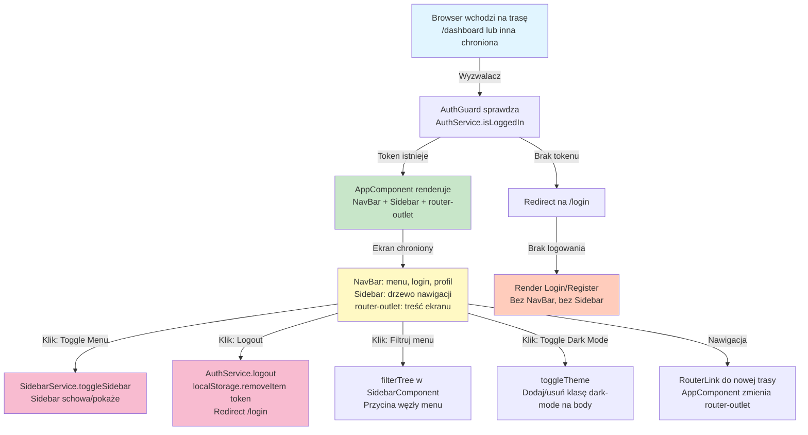

# A-00: AppShell — Przegląd End-to-End

## Cel przepływu

AppShell stanowi powłokę aplikacji i definiuje strukturę interfejsu dla wszystkich ekranów chronionych. Jego głównym celem jest:
1. Renderowanie nawigacji globalnej (navbar, sidebar) dla użytkownika zalogowanego
2. Zarządzanie routingiem między sekcjami aplikacji (Dashboard, Documents, Inventory, Settings)
3. Weryfikacja dostępu do tras chronionych poprzez AuthGuard
4. Obsługa logowania, wylogowania, przełączania menu bocznego i trybu ciemnego
5. Ukrycie menu bocznego dla ekranów publicznych (Login, Register)

## Diagram End-to-End

## Warunki wejścia

| Warstwa | Warunek |
|---|---|
| **UI (Frontend)** | Użytkownik klika link do trasy aplikacji (np. `/dashboard`) |
| **Frontend Service** | `AuthService` posiada token JWT w `localStorage` |
| **Guard** | `AuthGuard.canActivate()` zwraca `true` dla zalogowanego użytkownika |
| **AppComponent** | Router event `NavigationEnd` nie zawiera `/login` ani `/register` |
| **Backend** | N/D — AppShell nie komunikuje się z backendem |
| **Baza danych** | N/D — AppShell nie mapuje do bazy |

## Wynik przepływu — na każdej warstwie

| Warstwa | Wynik |
|---|---|
| **UI (Frontend)** | Wyświetlony navbar (z przyciskami login/register lub profil), sidebar (menu nawigacji), główny obszar roboczy (router-outlet) |
| **Frontend Service** | AuthService przechowuje userInfo (imię, email, inicjały) z dekodowanego tokenu JWT |
| **Router & Guard** | Trasa chroniona jest dostępna, użytkownik nie jest kierowany na `/login` |
| **AppComponent** | Komponent renderuje: `<app-navbar></app-navbar>` + `<app-sidebar></app-sidebar>` + `<router-outlet></router-outlet>` |
| **Backend / API** | [TYLKO FRONTEND] — brak wywołania API dla samego renderowania powłoki |
| **Baza danych** | [BRAK MAPOWANIA DO BAZY] — AppShell nie zapisuje ani nie odczytuje danych z bazy |

## Zakres dokumentu

### ✓ Zawarte w A-00
- Struktura i layout AppShell (navbar, sidebar, router-outlet)
- Logika routingu i guardy dostępu (AuthGuard)
- Operacje UI (toggle menu, logout, filtrowanie, toggle dark mode, nawigacja)
- Interceptory HTTP (AuthInterceptor, ErrorInterceptor) — zarządzanie tokenem JWT
- Komponenty: AppComponent, NavbarComponent, SidebarComponent
- Serwisy: AuthService, SidebarService, Router

### ✗ Niezawarte w A-00
- Szczegółowa logika ekranów szczegółowych (Dashboard, Invoices itp.) — te są w A-01, A-02 itd.
- Procesy backendu dla autoryzacji — te mogą być w P-XX (np. P-03: RegisterUser, P-04: LoginUser)
- Walidacja haseł, rejestracja użytkownika — te są w A-11 i A-12
- Zarządzanie firmami, produktami — to są A-06, A-07 itd.
