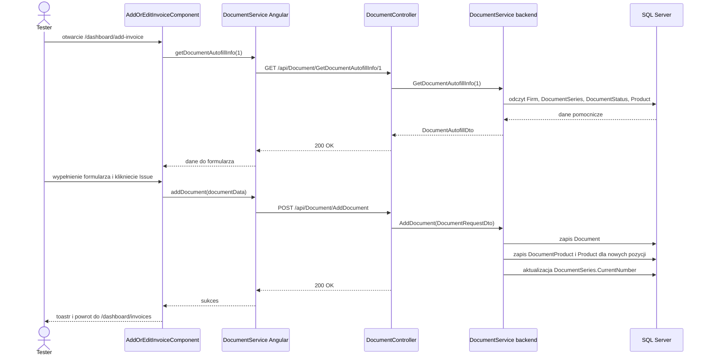

# Wystawienie nowej faktury - Przeglad end-to-end

## 1. Cel

Przepływ opisuje utwórzenie faktury z ekranu `Invoice Details`. Formularz pobiera dane pomocnicze z API, przyjmuje klienta, serie dokumentu, daty i pozycje dokumentu, a nastepnie zapisuje dokument w bazie.

## 2. Diagram

## 3. Warunki wejścia

| Warunek | Źródło |
|---|---|
| Użytkownik jest zalogowany | `AuthGuard`, `[Authorize(Roles = "User")]` |
| Użytkownik ma aktywna firme | `Users.GetUserFirmIdAsync()` |
| Aktywna firma ma aktywne konto bankowe | `BankAccounts.Query().Where(ba => ba.UserFirmId == userFirmId && ba.IsActive)` |
| Istnieje seria dokumentu dla typu `1` | `DocumentSeries` filtrowane po `DocumentTypeId == 1` |

## 4. Wynik

| Warstwa | Skutek |
|---|---|
| UI | Komunikat `Document added successfully` i przejście do `/dashboard/invoices`. |
| API | `POST /api/Document/AddDocument` zwraca `200 OK`. |
| Backend | `DocumentService.AddDocument()` twórzy dokument i pozycje. |
| Baza | Zapisy w `Document`, `DocumentProduct`, opcjonalnie `Product`; aktualizacja `DocumentSeries.CurrentNumber`. |
