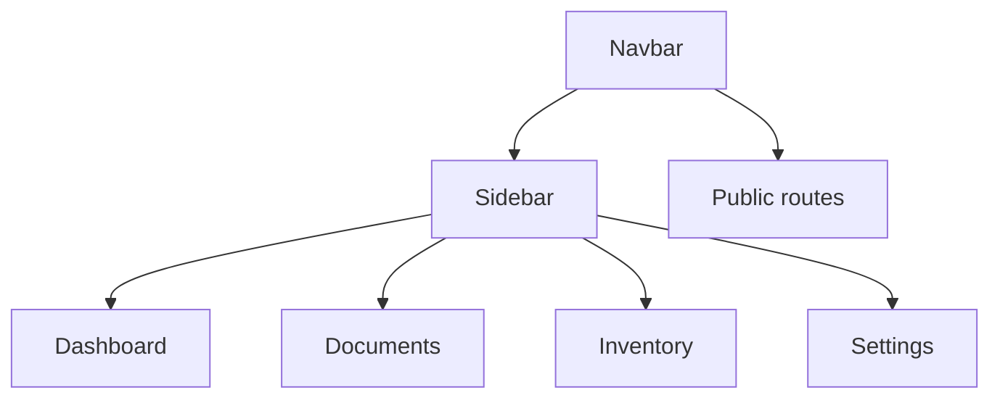

# Globalna mapa nawigacji i makiet

## 1. Diagram

## 2. Linki

| Element | Typ | Dokument |
|---|---|---|
| Dashboard | sekcja menu | [01_Dashboard](../01_Dashboard/01_DIAGRAM_SEKCJI.md) |
| Documents | sekcja menu | [02_Documents](../02_Documents/01_DIAGRAM_SEKCJI.md) |
| Inventory | sekcja menu | [03_Inventory](../03_Inventory/01_DIAGRAM_SEKCJI.md) |
| Settings | sekcja menu | [04_Settings](../04_Settings/01_DIAGRAM_SEKCJI.md) |
| Public | sekcja publiczna | [05_Public](../05_Public/01_DIAGRAM_SEKCJI.md) |
