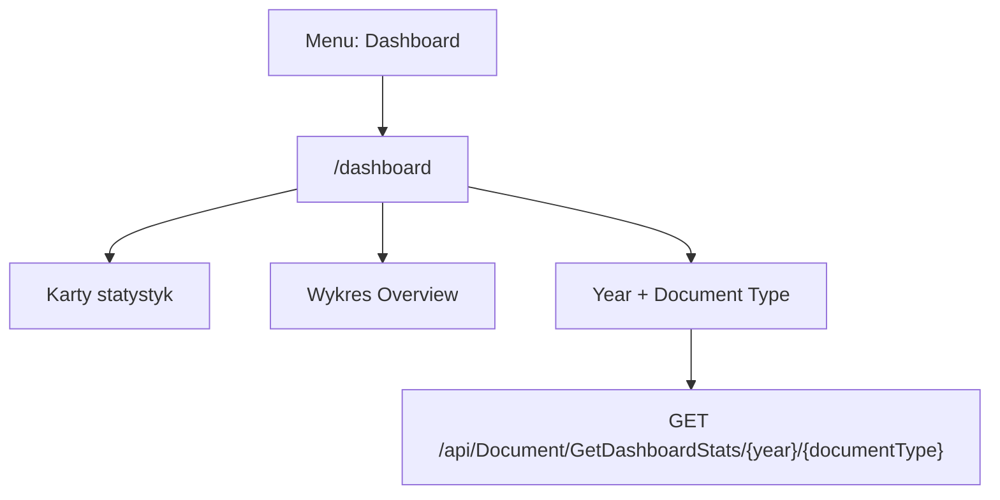

# Dashboard - Diagram sekcji

## 1. Diagram

## 2. Linki

| Element | Typ | Route | Dokument |
|---|---|---|---|
| Dashboard | ekran | `/dashboard` | [Rejestr A-01](../../REJESTR_PRZEPLYWOW_APLIKACJI.md) |
| Dashboard frontend | AOS frontendu | N/D | [E-01_Dashboard](../../../../../InvoiceJet/InvoiceJetUI/docs/aos/frontend/E-01_Dashboard/00_METADANE.md) |
