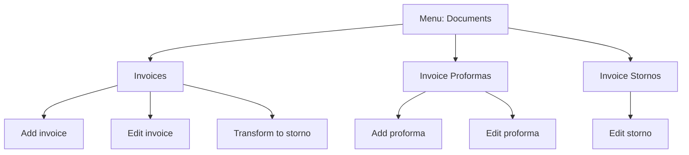

# Documents - Diagram sekcji

## 1. Diagram

## 2. Linki

| Pozycja | Route | Dokument pozycji |
|---|---|---|
| Invoices | `/dashboard/invoices` | [Invoices](./Invoices/01_MAPA_MAKIET_POZYCJI.md) |
| Invoice Proformas | `/dashboard/invoice-proformas` | [InvoiceProformas](./InvoiceProformas/01_MAPA_MAKIET_POZYCJI.md) |
| Invoice Stornos | `/dashboard/invoice-stornos` | [InvoiceStornos](./InvoiceStornos/01_MAPA_MAKIET_POZYCJI.md) |
