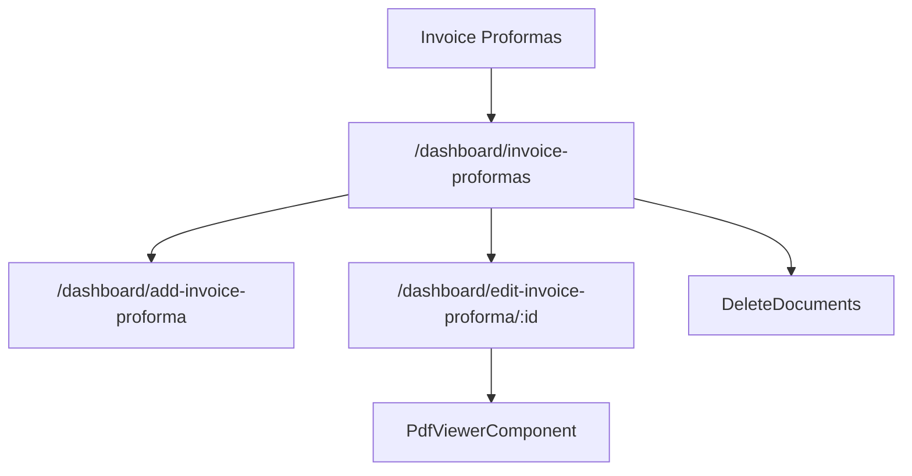

# Invoice Proformas - Mapa makiet pozycji

## 1. Diagram

## 2. Linki

| Element | Typ | Route | Dokument |
|---|---|---|---|
| Lista proform | ekran | `/dashboard/invoice-proformas` | [E-03_InvoiceProformas](../../../../../../InvoiceJet/InvoiceJetUI/docs/aos/frontend/E-03_InvoiceProformas/00_METADANE.md) |
| Formularz proformy | ekran potomny | `/dashboard/add-invoice-proforma` | [Rejestr A-03](../../../REJESTR_PRZEPLYWOW_APLIKACJI.md) |
