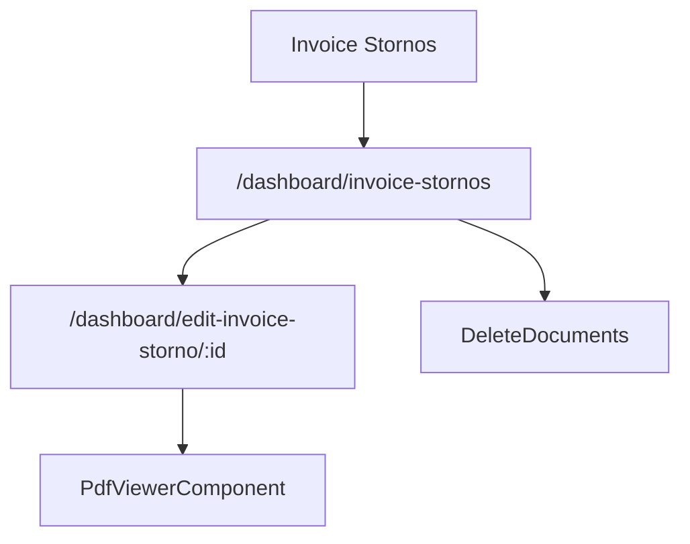

# Invoice Stornos - Mapa makiet pozycji

## 1. Diagram

## 2. Linki

| Element | Typ | Route | Dokument |
|---|---|---|---|
| Lista storn | ekran | `/dashboard/invoice-stornos` | [E-04_InvoiceStornos](../../../../../../InvoiceJet/InvoiceJetUI/docs/aos/frontend/E-04_InvoiceStornos/00_METADANE.md) |
| Edycja storna | ekran potomny | `/dashboard/edit-invoice-storno/:id` | [Rejestr A-04](../../../REJESTR_PRZEPLYWOW_APLIKACJI.md) |
