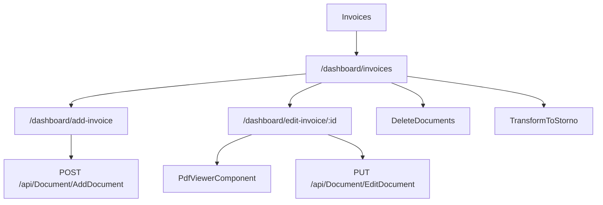

# Invoices - Mapa makiet pozycji

## 1. Diagram

## 2. Linki

| Element | Typ | Route | Dokument |
|---|---|---|---|
| Lista faktur | ekran | `/dashboard/invoices` | [E-02_Invoices](../../../../../../InvoiceJet/InvoiceJetUI/docs/aos/frontend/E-02_Invoices/00_METADANE.md) |
| Wystawienie faktury | przeplyw | `/dashboard/add-invoice` | [A-05_IssueNewInvoice](../../../flows/A-05_IssueNewInvoice/00_METADANE.md) |
| Edycja faktury | ekran potomny | `/dashboard/edit-invoice/:id` | [A-05_IssueNewInvoice](../../../flows/A-05_IssueNewInvoice/00_METADANE.md) |
