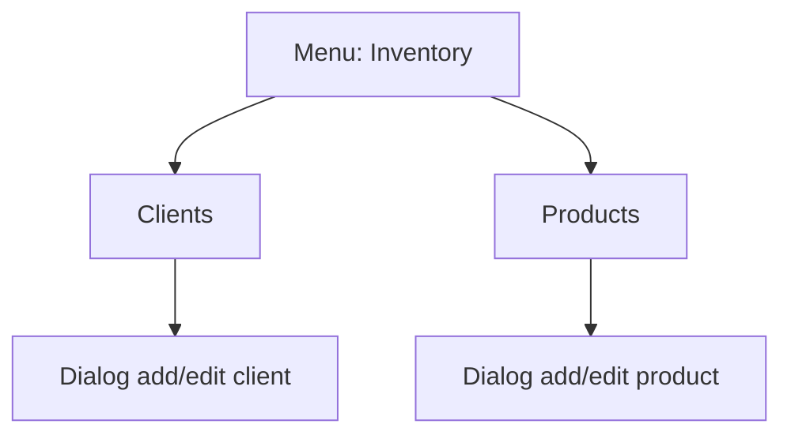

# Inventory - Diagram sekcji

## 1. Diagram

## 2. Linki

| Pozycja | Route | Dokument pozycji |
|---|---|---|
| Clients | `/dashboard/clients` | [Clients](./Clients/01_MAPA_MAKIET_POZYCJI.md) |
| Products | `/dashboard/products` | [Products](./Products/01_MAPA_MAKIET_POZYCJI.md) |
