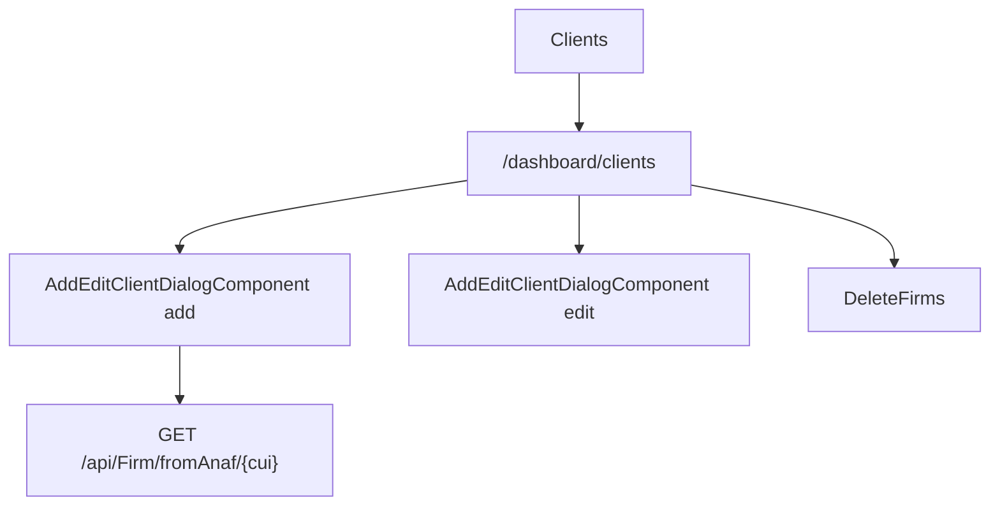

# Clients - Mapa makiet pozycji

## 1. Diagram

## 2. Linki

| Element | Typ | Route | Dokument |
|---|---|---|---|
| Lista klientow | ekran | `/dashboard/clients` | [E-06_Clients](../../../../../../InvoiceJet/InvoiceJetUI/docs/aos/frontend/E-06_Clients/00_METADANE.md) |
| Dialog klienta | dialog | N/D | [Rejestr A-06](../../../REJESTR_PRZEPLYWOW_APLIKACJI.md) |
