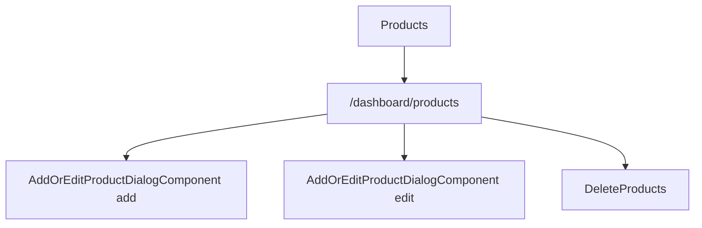

# Products - Mapa makiet pozycji

## 1. Diagram

## 2. Linki

| Element | Typ | Route | Dokument |
|---|---|---|---|
| Lista produktow | ekran | `/dashboard/products` | [E-07_Products](../../../../../../InvoiceJet/InvoiceJetUI/docs/aos/frontend/E-07_Products/00_METADANE.md) |
| Dialog produktu | dialog | N/D | [Rejestr A-07](../../../REJESTR_PRZEPLYWOW_APLIKACJI.md) |
