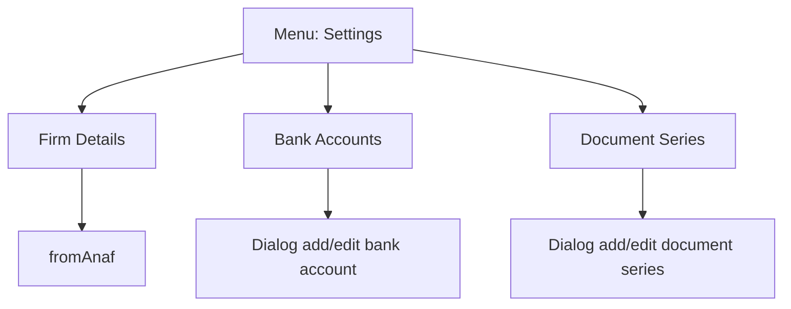

# Settings - Diagram sekcji

## 1. Diagram

## 2. Linki

| Pozycja | Route | Dokument pozycji |
|---|---|---|
| Firm Details | `/dashboard/firm-details` | [FirmDetails](./FirmDetails/01_MAPA_MAKIET_POZYCJI.md) |
| Bank Accounts | `/dashboard/bank-accounts` | [BankAccounts](./BankAccounts/01_MAPA_MAKIET_POZYCJI.md) |
| Document Series | `/dashboard/document-series` | [DocumentSeries](./DocumentSeries/01_MAPA_MAKIET_POZYCJI.md) |
