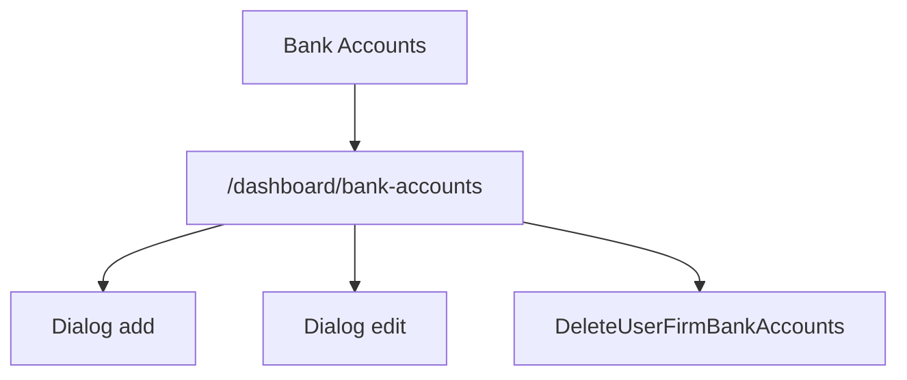

# Bank Accounts - Mapa makiet pozycji

## 1. Diagram

## 2. Linki

| Element | Typ | Route | Dokument |
|---|---|---|---|
| Lista kont | ekran | `/dashboard/bank-accounts` | [E-09_BankAccounts](../../../../../../InvoiceJet/InvoiceJetUI/docs/aos/frontend/E-09_BankAccounts/00_METADANE.md) |
| Dialog konta | dialog | N/D | [Rejestr A-09](../../../REJESTR_PRZEPLYWOW_APLIKACJI.md) |
