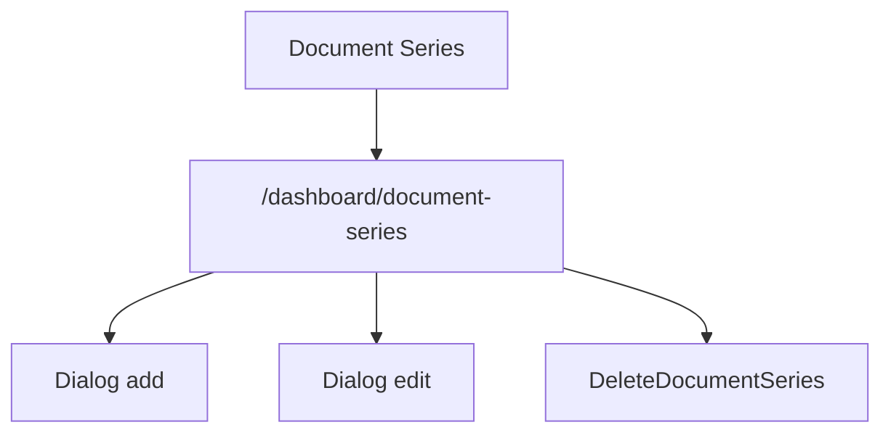

# Document Series - Mapa makiet pozycji

## 1. Diagram

## 2. Linki

| Element | Typ | Route | Dokument |
|---|---|---|---|
| Lista serii | ekran | `/dashboard/document-series` | [E-10_DocumentSeries](../../../../../../InvoiceJet/InvoiceJetUI/docs/aos/frontend/E-10_DocumentSeries/00_METADANE.md) |
| Dialog serii | dialog | N/D | [Rejestr A-10](../../../REJESTR_PRZEPLYWOW_APLIKACJI.md) |
