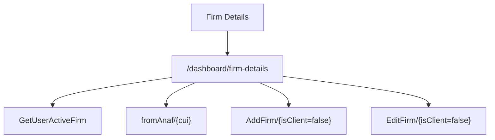

# Firm Details - Mapa makiet pozycji

## 1. Diagram

## 2. Linki

| Element | Typ | Route | Dokument |
|---|---|---|---|
| Dane firmy | ekran | `/dashboard/firm-details` | [E-08_FirmDetails](../../../../../../InvoiceJet/InvoiceJetUI/docs/aos/frontend/E-08_FirmDetails/00_METADANE.md) |
