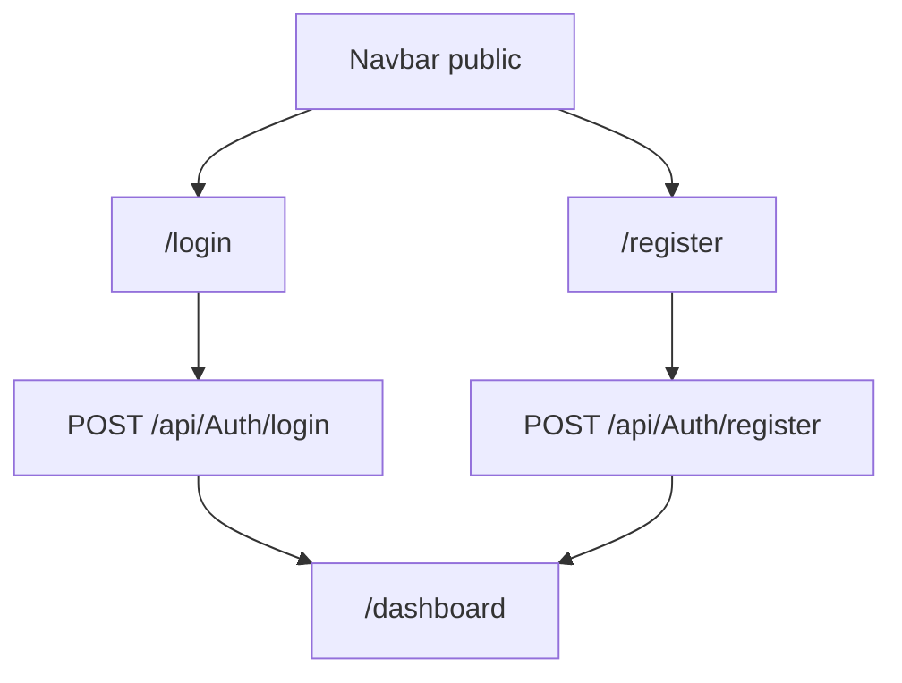

# Public - Diagram sekcji

## 1. Diagram

## 2. Linki

| Pozycja | Route | Dokument pozycji |
|---|---|---|
| Login | `/login` | [Login](./Login/01_MAPA_MAKIET_POZYCJI.md) |
| Register | `/register` | [Register](./Register/01_MAPA_MAKIET_POZYCJI.md) |
