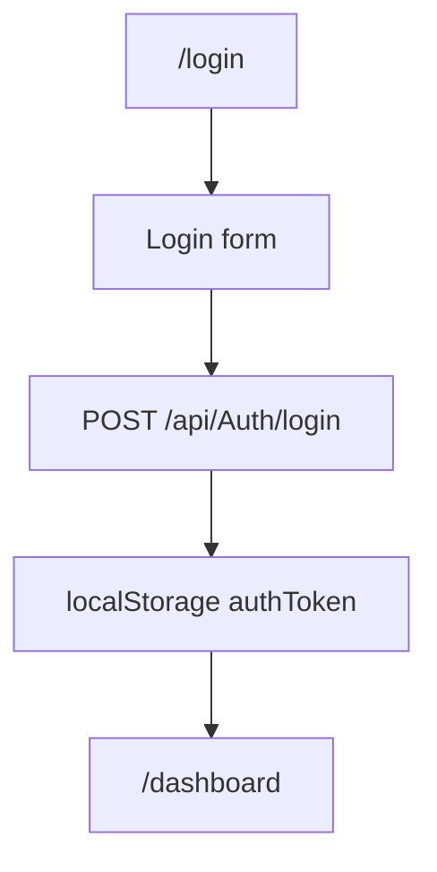

# Login - Mapa makiet pozycji

## 1. Diagram

## 2. Linki

| Element | Typ | Route | Dokument |
|---|---|---|---|
| Logowanie | ekran | `/login` | [E-11_Login](../../../../../../InvoiceJet/InvoiceJetUI/docs/aos/frontend/E-11_Login/00_METADANE.md) |
