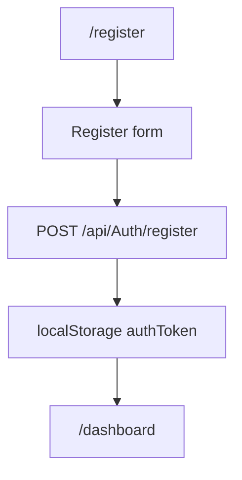

# Register - Mapa makiet pozycji

## 1. Diagram

## 2. Linki

| Element | Typ | Route | Dokument |
|---|---|---|---|
| Rejestracja | ekran | `/register` | [E-12_Register](../../../../../../InvoiceJet/InvoiceJetUI/docs/aos/frontend/E-12_Register/00_METADANE.md) |
