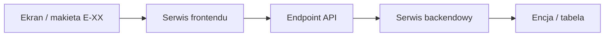

# [A-XX_NAZWA] - Przeglad end-to-end

## 1. Cel przepływu

[Opis celu z perspektywy użytkownika. Jeden akapit. Bez zgadywania logiki, ktora nie wynika z dokumentacji.]

## 2. Diagram end-to-end

## 3. Warunki wejścia

| Warunek | Warstwa | Dowód | Uwagi |
|---|---|---|---|
| `[Warunek]` | UI/API/DB | `[link]` | N/D |

## 4. Wynik przepływu

| Obszar | Wynik | Dowód |
|---|---|---|
| UI | `[Komunikat, nawigacja, odświeżenie widoku]` / N/D | `[link]` |
| API | `[Status HTTP / DTO odpowiedźi]` / N/D | `[link]` |
| Backend | `[Operacja serwisu]` / N/D | `[link]` |
| Baza | `[Tabela.kolumna / rekord]` / N/D | `[link]` |

## 5. Zakres i wykluczenia

| Element | Status | Uzasadnienie |
|---|---|---|
| `[Element]` | W zakresie / Poza zakresem / N/D | `[Dowód lub marker]` |

## 6. Reguły wypełniania

- Brak danych zapisuj jako `N/D`.
- Informacje niepotwierdzone oznaczaj `[WYMAGA WERYFIKACJI]`.
- Gdy ślad UI do bazy urywa sie przed baza, oznacz `[BRAK MAPOWANIA DO BAZY]`.
- Szczegółowe markery: [05_MARKERY_I_JAKOSC.md](../../../FullStackAgentAI/05_MARKERY_I_JAKOSC.md).
