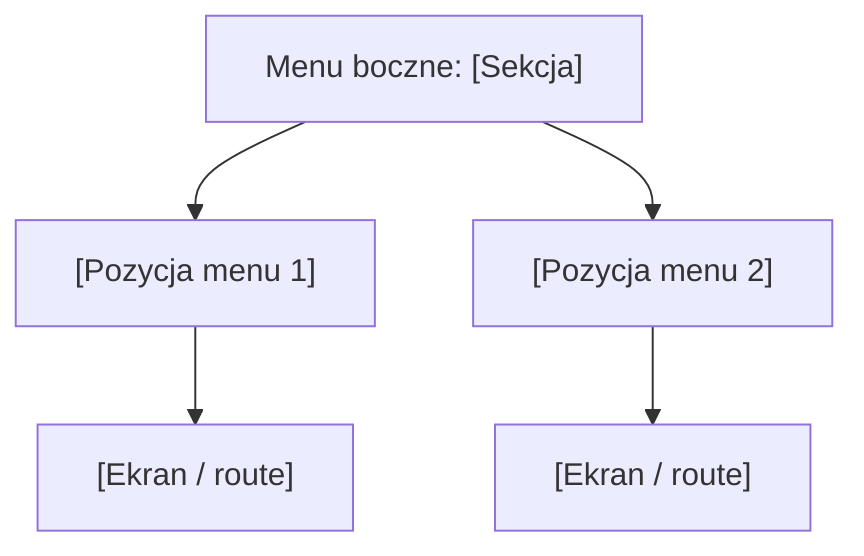

# [NAZWA_SEKCJI] - Diagram sekcji

## 1. Diagram Mermaid

## 2. Tabela linków

| Element | Typ | Route | Dokument AOS aplikacyjny | Dokument AOS frontendu | Uwagi |
|---|---|---|---|---|---|
| `[Nazwa]` | Sekcja / pozycja / ekran / dialog / podgląd | `[route]` / N/D | `[link]` / N/D | `[link]` / N/D | N/D |

## 3. Powiązane przepływy

| Pozycja menu | Przepływ aplikacyjny | Proces backend | Dowód |
|---|---|---|---|
| `[Nazwa]` | `[A-XX]` / N/D | `[P-XX]` / N/D | `[link]` |

## 4. Reguły wypełniania

- Diagram Mermaid jest obowiązkowy.
- Tabela linków Markdown jest obowiązkowa i jest źródłem nawigacji.
- Brak danych zapisuj jako `N/D`.
- Informacje niepotwierdzone oznaczaj `[WYMAGA WERYFIKACJI]`.
- Brak potwierdzenia w dokumentacji oznacz `[BRAK POTWIERDZENIA W DOKUMENTACJI]`.
- Szczegółowe markery: [05_MARKERY_I_JAKOSC.md](../../../FullStackAgentAI/05_MARKERY_I_JAKOSC.md).
