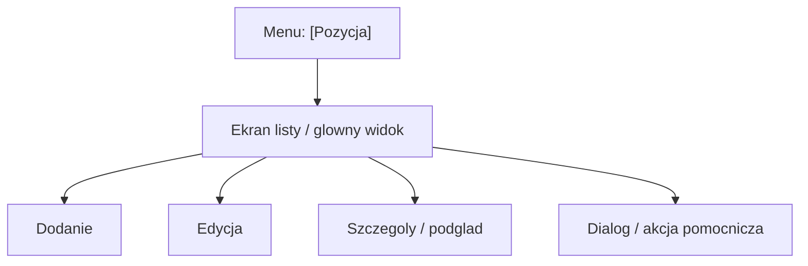

# [NAZWA_POZYCJI_MENU] - Mapa makiet pozycji

## 1. Diagram Mermaid

## 2. Tabela makiet

| Element | Typ | Route / wyzwalacz | Dokument AOS aplikacyjny | Dokument AOS frontendu | Dowod |
|---|---|---|---|---|---|
| `[Nazwa elementu]` | Ekran / dialog / podglad / akcja | `[route lub klik]` / N/D | `[link]` / N/D | `[link]` / N/D | `[link]` |

## 3. Przejscia i akcje

| Z elementu | Do elementu | Wyzwalacz | Efekt | Dowod |
|---|---|---|---|---|
| `[Element A]` | `[Element B]` | `[Przycisk / route / akcja]` | `[Opis]` / N/D | `[link]` |

## 4. Reguly wypelniania

- Diagram Mermaid jest obowiazkowy.
- Tabela makiet Markdown jest obowiazkowa.
- Brak danych zapisuj jako `N/D`.
- Informacje niepotwierdzone oznaczaj `[WYMAGA WERYFIKACJI]`.
- Brak potwierdzenia w dokumentacji oznacz `[BRAK POTWIERDZENIA W DOKUMENTACJI]`.
- Szczegolowe markery: [05_MARKERY_I_JAKOSC.md](../../../FullStackAgentAI/05_MARKERY_I_JAKOSC.md).
