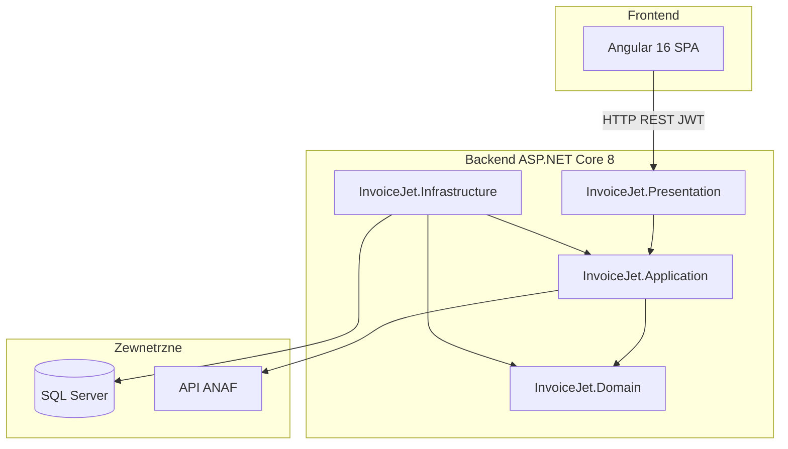

# Stos technologiczny — InvoiceJet

Dokument opisuje języki, frameworki, biblioteki, wzorce architektoniczne i technologie wykorzystane w aplikacji **InvoiceJet** — systemie webowym do wystawiania i zarządzania fakturami dla małych i średnich firm. Informacje pochodzą z analizy kodu źródłowego i plików konfiguracyjnych projektu.

---

## 1. Wprowadzenie

InvoiceJet to aplikacja typu **SPA (Single Page Application)** połączona z **REST API**. Frontend komunikuje się z backendem przez HTTP z tokenem JWT. Architektura backendu opiera się na zasadach **Clean Architecture** z podziałem na cztery warstwy logiczne.



### Struktura repozytorium

| Ścieżka | Opis |
|---------|------|
| `InvoiceJet/InvoiceJetAPI/` | Rozwiązanie .NET (`InvoiceJet.sln`) — backend |
| `InvoiceJet/InvoiceJetUI/` | Aplikacja Angular — frontend |

---

## 2. Języki i środowiska uruchomieniowe

| Język / technologia | Zastosowanie | Szczegóły |
|---------------------|--------------|-----------|
| **C#** | Backend | .NET 8 (`net8.0`), włączone nullable reference types i implicit usings |
| **TypeScript** | Frontend | Wersja `~5.0.2` (Angular CLI) |
| **SCSS** | Style UI | Style komponentów Angular (`inlineStyleLanguage: scss`) |
| **SQL** | Baza danych | Schemat zarządzany przez Entity Framework Core Migrations (podejście code-first) |
| **HTML / CSS** | Szablony UI | Standardowe pliki Angular + motyw Material |

### Wymagania uruchomieniowe (dev)

- **.NET 8 SDK** — uruchomienie API (`dotnet run` w projekcie Presentation)
- **Node.js + npm** — frontend (`ng serve`, domyślnie port `4200`)
- **Microsoft SQL Server** — lokalnie (np. SQL Express) lub zdalnie (Azure SQL)

---

## 3. Backend — ASP.NET Core 8

### 3.1 Framework i hosting

- **ASP.NET Core Web API** — projekt `InvoiceJet.Presentation` (`Microsoft.NET.Sdk.Web`)
- **Minimal hosting model** — konfiguracja w `Program.cs` (rejestracja DI, middleware, mapowanie kontrolerów)
- **ASP.NET Core 8.0.6** — pakiety `Microsoft.AspNetCore.*` w warstwie Presentation

### 3.2 Clean Architecture — warstwy

| Warstwa | Projekt | Odpowiedzialność |
|---------|---------|------------------|
| **Domain** | `InvoiceJet.Domain` | Encje biznesowe, enums, wyjątki domenowe, interfejsy repozytoriów i `IUnitOfWork` |
| **Application** | `InvoiceJet.Application` | Serwisy biznesowe, DTO, profile AutoMapper, logika aplikacyjna |
| **Infrastructure** | `InvoiceJet.Infrastructure` | `InvoiceJetDbContext`, repozytoria, migracje EF, generowanie PDF (QuestPDF) |
| **Presentation** | `InvoiceJet.Presentation` | Kontrolery REST, middleware, seedery, konfiguracja aplikacji |

### 3.3 Kluczowe biblioteki NuGet

#### Warstwa Presentation (`InvoiceJet.Presentation.csproj`)

| Biblioteka | Wersja | Rola |
|------------|--------|------|
| Entity Framework Core | 8.0.6 | ORM |
| Microsoft.EntityFrameworkCore.SqlServer | 8.0.6 | Provider SQL Server |
| Microsoft.EntityFrameworkCore.Tools | 8.0.6 | Narzędzia migracji (CLI) |
| Microsoft.AspNetCore.Authentication.JwtBearer | 8.0.6 | Uwierzytelnianie JWT |
| Microsoft.AspNetCore.OpenApi | 8.0.6 | OpenAPI |
| Microsoft.Data.SqlClient | 5.2.1 | Klient SQL Server |
| AutoMapper | 13.0.1 | Mapowanie obiektów |
| AutoMapper.Collection | 10.0.0 | Mapowanie kolekcji |
| BCrypt.Net-Next | 4.0.3 | Hashowanie haseł |
| QuestPDF | 2024.3.10 | Generowanie dokumentów PDF |
| Swashbuckle.AspNetCore | 6.6.2 | Swagger / OpenAPI UI |
| Swashbuckle.AspNetCore.Filters | 7.0.12 | Filtry bezpieczeństwa w Swagger |
| Newtonsoft.Json | 13.0.3 | Serializacja JSON |

#### Warstwa Application (`InvoiceJet.Application.csproj`)

| Biblioteka | Wersja | Rola |
|------------|--------|------|
| AutoMapper | 13.0.1 | Mapowanie DTO |
| BCrypt.Net-Next | 4.0.3 | Hashowanie haseł |
| Microsoft.EntityFrameworkCore | 8.0.6 | Dostęp do kontekstu przez Unit of Work |
| Microsoft.IdentityModel.Tokens | 7.1.2 | Tworzenie tokenów JWT |
| System.IdentityModel.Tokens.Jwt | 7.1.2 | Obsługa JWT |
| Newtonsoft.Json | 13.0.3 | Parsowanie odpowiedzi API ANAF |
| Microsoft.Extensions.Configuration.Abstractions | 9.0.0-preview.4.24266.19 | Odczyt konfiguracji |

#### Warstwa Infrastructure (`InvoiceJet.Infrastructure.csproj`)

| Biblioteka | Wersja | Rola |
|------------|--------|------|
| Microsoft.EntityFrameworkCore (+ SqlServer, Tools, Design) | 8.0.6 | Persystencja i migracje |
| QuestPDF | 2024.3.10 | Szablony PDF faktur |

### 3.4 Wzorce i mechanizmy

- **Repository + Unit of Work** — `IGenericRepository<T>`, `IUnitOfWork`, implementacje w Infrastructure
- **DTO (Data Transfer Objects)** — wymiana danych między warstwami i API
- **Dependency Injection** — rejestracja serwisów, repozytoriów i `DbContext` w `Program.cs`
- **AutoMapper** — mapowanie encji domenowych na DTO i odwrotnie
- **Exception Middleware** — globalna obsługa wyjątków domenowych (`ExceptionMiddleware`), odpowiedzi w formacie JSON (`System.Text.Json`)
- **DbSeeder** — seed typów dokumentów przy starcie aplikacji
- **CORS** — polityka `NgOrigins` dla originów Angular (`http://localhost:4200`, `https://localhost:4200`)

### 3.5 Kontrolery REST API

| Kontroler | Ścieżka bazowa | Uwagi |
|-----------|----------------|-------|
| `AuthController` | `/api/auth` | Rejestracja i logowanie (bez `[Authorize]`) |
| `FirmController` | `/api/firm` | Firmy i klienci, integracja ANAF |
| `ProductController` | `/api/product` | Produkty / usługi |
| `DocumentController` | `/api/document` | Faktury, proformy, storna, PDF |
| `DocumentSeriesController` | `/api/documentseries` | Serie numeracji dokumentów |
| `BankAccountController` | `/api/bankaccount` | Konta bankowe |

Większość kontrolerów wymaga uwierzytelnienia: `[Authorize(Roles = "User")]`.

### 3.6 Generowanie PDF

- **QuestPDF** (licencja **Community**) — konfiguracja w `Program.cs`
- Szablony dokumentów w `InvoiceJet.Infrastructure/Services/IQuestPDFDocument/`:
  - faktura (`Invoice.cs`)
  - faktura proforma (`ProformaInvoice.cs`)
  - faktura korygująca / storno (`StornoInvoice.cs`)
- Serwis `PdfGenerationService` — generowanie plików PDF na żądanie API

### 3.7 Dokumentacja API

- **Swagger UI** — włączony tylko w środowisku `Development`
- **Swashbuckle** — definicja schematu OAuth2/Bearer w nagłówku `Authorization`

---

## 4. Frontend — Angular 16

> **Uwaga:** W `package.json` nazwa pakietu to historycznie `facturila-ui`, natomiast repozytorium i produkt to **InvoiceJet**.

### 4.1 Rdzeń frameworka

| Technologia | Wersja | Rola |
|-------------|--------|------|
| Angular | ^16.0.0 – ^16.2.14 | Framework SPA (struktura modułowa `NgModule`) |
| Angular CLI | ~16.0.2 | Budowanie i serwowanie aplikacji |
| TypeScript | ~5.0.2 | Język frontendu |
| RxJS | ~7.8.0 | Programowanie reaktywne (obserwowalne strumienie) |
| Zone.js | ~0.13.0 | Wykrywanie zmian w Angular |

### 4.2 Moduły Angular

- `@angular/router` — routing, trasy chronione przez `AuthGuard`
- `@angular/forms` — formularze (FormsModule, ReactiveFormsModule)
- `@angular/common/http` — komunikacja z REST API (`HttpClientModule`)
- `@angular/animations` + `BrowserAnimationsModule` — animacje UI

### 4.3 UI i biblioteki pomocnicze

| Biblioteka | Wersja | Rola |
|------------|--------|------|
| Angular Material | ^16.2.14 | Komponenty UI (tabele, dialogi, formularze, paginator) |
| Angular CDK | ^16.2.14 | Podstawowe prymitywy UI |
| ngx-toastr | ^19.0.0 | Powiadomienia toast (sukces, błąd) |
| ng2-charts | ^5.0.4 | Wykresy na dashboardzie |
| chart.js | ^4.3.0 | Silnik wykresów (używany przez ng2-charts) |
| @auth0/angular-jwt | ^5.2.0 | Dekodowanie i walidacja tokenów JWT po stronie klienta |

Motyw Material: **indigo-pink** (prebuilt theme w `angular.json`).

### 4.4 Komunikacja z API

- **Serwisy HTTP** — `auth.service`, `document.service`, `firm.service`, `product.service`, `bank-account.service`, `document-series.service`, `user.service`
- **HTTP Interceptors:**
  - `AuthInterceptor` — dołączanie nagłówka `Authorization: Bearer {token}`
  - `ErrorInterceptor` — obsługa błędów HTTP
- **Konfiguracja środowiska** — `environment.apiUrl` (np. `https://localhost:7229/api` w developmencie)

### 4.5 Routing i bezpieczeństwo klienta

- Trasy publiczne: `/login`, `/register`
- Trasy chronione (`canActivate: [AuthGuard]`): dashboard, faktury, klienci, produkty itd.
- `TokenExpiredDialogComponent` — informacja o wygaśnięciu sesji JWT

### 4.6 Główne moduły funkcjonalne (komponenty)

| Obszar | Komponenty |
|--------|------------|
| Uwierzytelnianie | `LoginComponent`, `RegisterComponent` |
| Dashboard | `DashboardComponent` (wykresy, statystyki) |
| Firma | `FirmDetailsComponent`, `ClientsComponent`, dialogi edycji |
| Produkty | `ProductsComponent`, `AddOrEditProductDialogComponent` |
| Dokumenty | `InvoicesComponent`, `InvoiceProformasComponent`, `InvoiceStornosComponent` |
| Serie dokumentów | `DocumentSeriesComponent` |
| Konta bankowe | `BankAccountsComponent` |
| PDF | `PdfViewerComponent` |
| Layout | `NavbarComponent`, `SidebarComponent` |

### 4.7 Testy (devDependencies)

| Narzędzie | Wersja |
|-----------|--------|
| Jasmine | ~4.6.0 |
| Karma | ~6.4.0 |
| karma-jasmine | ~5.1.0 |
| karma-chrome-launcher | ~3.2.0 |
| karma-coverage | ~2.2.0 |

Uruchomienie: `ng test` (standardowy stack Angular CLI).

---

## 5. Baza danych

### 5.1 System zarządzania

- **Microsoft SQL Server**
- **Entity Framework Core 8.0.6** — podejście **Code First**
- Kontekst: `InvoiceJetDbContext` (warstwa Infrastructure)

### 5.2 Migracje

| Migracja | Data | Opis |
|----------|------|------|
| `20240624165318_InitialCreate` | 2024-06-24 | Początkowy schemat bazy |

### 5.3 Główne encje domenowe

| Encja | Opis |
|-------|------|
| `User` | Użytkownik systemu |
| `Firm` | Firma (własna lub klient) |
| `UserFirm` | Powiązanie użytkownik–firma (flaga `IsClient`) |
| `Product` | Produkty / usługi na fakturze |
| `Document` | Dokument (faktura, proforma, storno) |
| `DocumentProduct` | Pozycje na dokumencie |
| `DocumentSeries` | Serie numeracji |
| `DocumentType` | Typ dokumentu |
| `DocumentStatus` | Status dokumentu |
| `BankAccount` | Konto bankowe firmy |

### 5.4 Środowiska połączeń

- **Development** — lokalny SQL Server Express, baza `FacturilaDB` (connection string w `appsettings.json`)
- **Produkcja** — Azure SQL Database (host w Azure; szczegóły połączenia w konfiguracji, nie w tym dokumencie)

---

## 6. Integracje zewnętrzne

### API ANAF (Rumunia)

- **Cel:** Pobieranie danych rejestrowych firmy (VAT) na podstawie identyfikatora podatkowego (CUI)
- **Endpoint:** `https://webservicesp.anaf.ro/PlatitorTvaRest/api/v8/ws/tva` (konfiguracja `AppSettings:AnafApiUrl`)
- **Implementacja:** `FirmService` — wywołanie HTTP, parsowanie JSON (`Newtonsoft.Json`)
- **Obsługa błędów:** `AnafFirmNotFoundException` → HTTP 404, komunikat na UI (ngx-toastr)

---

## 7. Bezpieczeństwo i uwierzytelnianie

| Aspekt | Technologia / mechanizm |
|--------|-------------------------|
| Hashowanie haseł | BCrypt (`BCrypt.Net-Next` 4.0.3) |
| Token sesji | JWT (symetryczny klucz z `AppSettings:Token`) |
| Walidacja tokenu | `Microsoft.AspNetCore.Authentication.JwtBearer` |
| Tworzenie tokenu | `System.IdentityModel.Tokens.Jwt` + `Microsoft.IdentityModel.Tokens` |
| Autoryzacja API | `[Authorize(Roles = "User")]` na kontrolerach |
| Frontend | `AuthInterceptor`, `AuthGuard`, `@auth0/angular-jwt` |
| HTTPS | `UseHttpsRedirection()` w pipeline ASP.NET Core |
| CORS | Ograniczenie do originów Angular (dev) |

Parametry JWT: walidacja podpisu i czasu życia tokenu; issuer i audience wyłączone z walidacji (`ValidateIssuer = false`, `ValidateAudience = false`).

---

## 8. Funkcjonalności aplikacji a technologie

| Funkcjonalność | Warstwa / technologie |
|----------------|----------------------|
| Rejestracja i logowanie | `AuthController`, `AuthService`, JWT, BCrypt, `LoginComponent`, `RegisterComponent` |
| Zarządzanie firmą własną | `FirmService`, EF Core, `FirmDetailsComponent` |
| Zarządzanie klientami | `UserFirm`, dialogi Material, `ClientsComponent` |
| Produkty i usługi | `ProductController`, `ProductsComponent` |
| Serie numeracji | `DocumentSeriesController`, `DocumentSeriesComponent` |
| Konta bankowe | `BankAccountController`, `BankAccountsComponent` |
| Faktury VAT | `DocumentService`, `InvoicesComponent`, QuestPDF (`Invoice`) |
| Faktury proforma | `ProformaInvoice`, `InvoiceProformasComponent` |
| Faktury korygujące (storno) | `StornoInvoice`, `InvoiceStornosComponent` |
| Podgląd PDF przed wystawieniem | `PdfViewerComponent`, endpoint generujący PDF |
| Dashboard i analityka | `DashboardComponent`, ng2-charts, Chart.js, API statystyk |
| Autouzupełnianie danych firmy | Integracja API ANAF, `FirmService` |
| Powiadomienia użytkownika | ngx-toastr |
| Obsługa błędów biznesowych | Wyjątki domenowe + `ExceptionMiddleware` |

---

## 9. Narzędzia deweloperskie i wdrożenie

| Obszar | Narzędzia |
|--------|-----------|
| Backend IDE / CLI | Visual Studio, `dotnet build`, `dotnet run`, `dotnet ef` (migracje) |
| Frontend | Angular CLI (`ng serve`, `ng build`, `ng test`) |
| Dokumentacja API | Swagger UI (środowisko Development) |
| Kontrola wersji | Git |
| Hosting (historycznie) | Microsoft Azure (SQL Database + hosting API/UI — opis w README projektu) |

W repozytorium **nie** zdefiniowano: Docker, Kubernetes, pipeline CI/CD.

### Uruchomienie lokalne (skrót)

```bash
# Backend
cd InvoiceJet/InvoiceJetAPI/InvoiceJet.Presentation
dotnet run

# Frontend
cd InvoiceJet/InvoiceJetUI
npm install
ng serve
```

Frontend: `http://localhost:4200`  
API (dev): konfiguracja w `launchSettings.json` / `environment.ts`

---

## 10. Stos technologiczny w skrócie

| Kategoria | Wybór technologiczny |
|-----------|----------------------|
| Język backend | C# / .NET 8 |
| Framework backend | ASP.NET Core Web API 8 |
| Architektura backend | Clean Architecture (4 warstwy) |
| ORM | Entity Framework Core 8.0.6 |
| Baza danych | Microsoft SQL Server |
| Język frontend | TypeScript 5 |
| Framework frontend | Angular 16 |
| UI | Angular Material 16 |
| Uwierzytelnianie | JWT + BCrypt |
| PDF | QuestPDF 2024.3.10 |
| Dokumentacja API | Swagger (Swashbuckle 6.6.2) |
| Wykresy | Chart.js 4 + ng2-charts 5 |
| Integracja zewnętrzna | API ANAF (Rumunia) |
| Testy frontend | Jasmine + Karma |
| Mapowanie obiektów | AutoMapper 13.0.1 |

---

*Dokument wygenerowany na podstawie stanu repozytorium InvoiceJet. Wersje bibliotek odpowiadają plikom `*.csproj` i `package.json`.*
