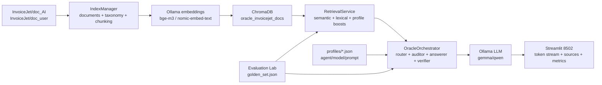
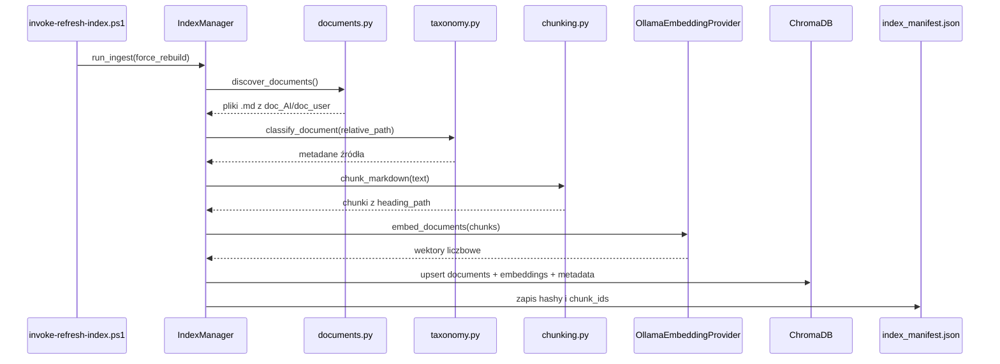
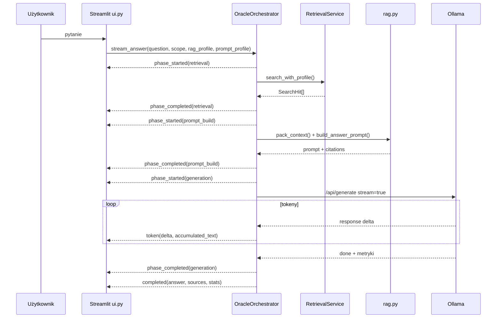
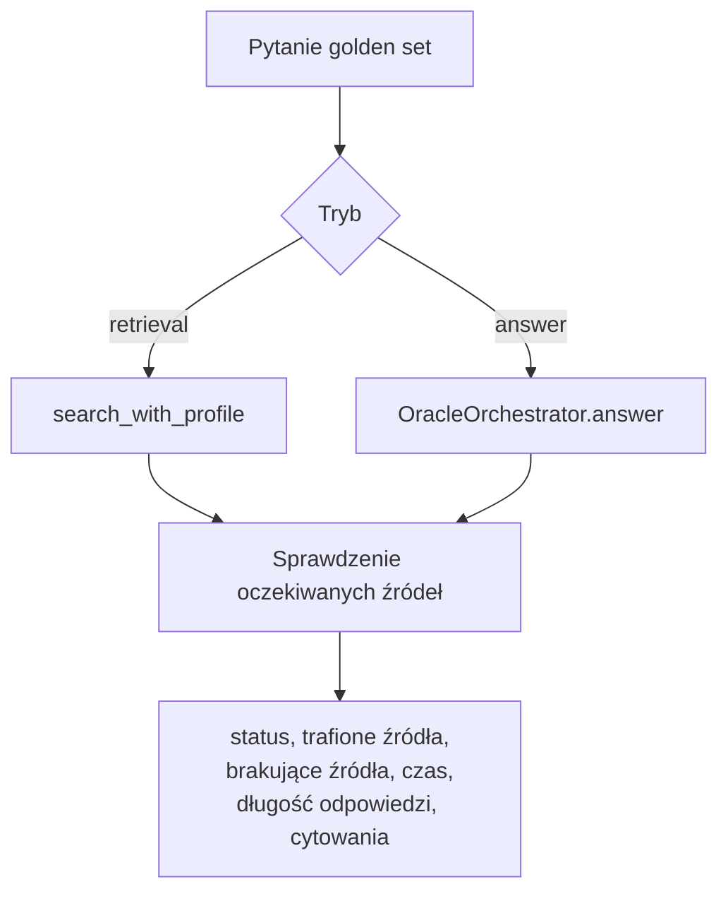

# Architektura i pipeline

Oracle InvoiceJet jest lokalnym portalem RAG dla dokumentacji projektu InvoiceJet. System pobiera Markdowny z repozytorium, dzieli je na fragmenty, zamienia fragmenty na embeddingi, zapisuje je w ChromaDB, a potem dla pytania użytkownika wyszukuje najlepszy kontekst i przekazuje go do lokalnego modelu Ollama.

## Widok wysokiego poziomu

## Główne moduły

- `config.py` - ładuje konfigurację z `.env` i zmiennych `ORACLE_*`.
- `documents.py` - znajduje pliki Markdown w źródłach projektu.
- `taxonomy.py` - klasyfikuje dokumenty i nadaje metadane: `source_type`, `area`, `entity`, `screen`, `table`, `endpoint`.
- `chunking.py` - dzieli dokumenty na chunki z informacją o nagłówkach.
- `embeddings.py` - klient Ollamy dla embeddingów i generacji.
- `indexing.py` - buduje lub odświeża indeks Chroma.
- `manifest.py` - pamięta stan indeksu, hashe plików i identyfikatory chunków.
- `retrieval.py` - wyszukuje kontekst w Chroma i dogrywa trafienia leksykalne.
- `rag_profiles.py` - definiuje profile RAG dla różnych typów pytań.
- `rag.py` - pakuje kontekst, buduje prompt i listę cytowań.
- `agents.py` - orkiestruje cały przebieg odpowiedzi i emituje eventy streamingu.
- `profiles.py` oraz `agent_profiles.py` - ładują profile modeli, promptów i agentów.
- `evaluation.py` - uruchamia golden set i zapisuje wyniki jakościowe.
- `ui.py` - renderuje portal Streamlit.

## Pipeline indeksowania

Indeksowanie to etap przygotowania bazy wiedzy.

Indeks v2 zapisuje metadane przy każdym chunku. To jest kluczowe dla pytań przekrojowych, np. "Na ekranie X jest pole Y, z jakiej tabeli pochodzi?". Samo podobieństwo semantyczne często znalazłoby tylko opis ekranu, a profil `cross_reference` wymusza dogranie kontekstu z mapowań, API, modelu danych, procesów i walidacji.

## Pipeline odpowiedzi

Odpowiedź jest generowana eventowo. UI nie zna szczegółów retrievalu ani promptowania; tylko nasłuchuje eventów z `OracleOrchestrator.stream_answer()`.

## Kontrakt eventów

Aktualny kontrakt jest świadomie zbliżony do przyszłego SSE/API:

- `phase_started` - etap się rozpoczął: `retrieval`, `prompt_build`, `generation`.
- `phase_completed` - etap się zakończył i może dołączyć częściowe metryki.
- `token` - nowy fragment odpowiedzi: `delta` oraz `accumulated_text`.
- `completed` - finalna odpowiedź, źródła, ostrzeżenia, trace i metryki.
- `error` - krótki komunikat użytkowy i szczegóły techniczne do diagnostyki.

W przyszłym API można mapować te eventy bez zmiany logiki pipeline:

- `phase_started` i `phase_completed` -> `event: phase`,
- `token` -> `event: token`,
- `completed` -> `event: done`,
- `error` -> `event: error`.

## Agenci w obecnej wersji

To nie są jeszcze autonomiczne agenty wykonujące narzędzia mutujące. Obecna warstwa agentowa to rozdzielenie odpowiedzialności w pipeline:

- `RouterAgent` dobiera zakres źródeł, jeżeli użytkownik go nie wymusił.
- `RetrieverAgent` pobiera kontekst z Chroma przez profil RAG.
- `SourceAuditorAgent` sprawdza, czy dla pytań przekrojowych retrieval znalazł różne klasy źródeł.
- `AnswererAgent` wywołuje lokalny model Ollama.
- `VerifierAgent` pilnuje fallbacku i cytowań.
- `OracleOrchestrator` spina całość w jeden przebieg.

Taka architektura pozwala później dodać narzędzia read-only, np. `search_docs`, `read_source`, `run_eval_set`, bez przepisywania UI.

## Pipeline ewaluacji

Evaluation Lab działa na stałym zestawie pytań z `eval/golden_set.json`.

Tryb `retrieval` jest szybki i służy do strojenia profili RAG. Tryb `answer` uruchamia pełne LLM i mierzy jakość finalnej odpowiedzi, ale jest wolniejszy.

## Artefakty danych

- `chroma_data/` - lokalna baza Chroma, nie jest commitowana.
- `index_manifest.json` - lokalny manifest indeksu, nie jest commitowany.
- `profiles/*.json` - profile agentów, modeli i promptów, są commitowane.
- `eval/golden_set.json` - zestaw pytań regresyjnych, jest commitowany.
- `.env` - lokalne nadpisania konfiguracji, nie jest commitowany.
